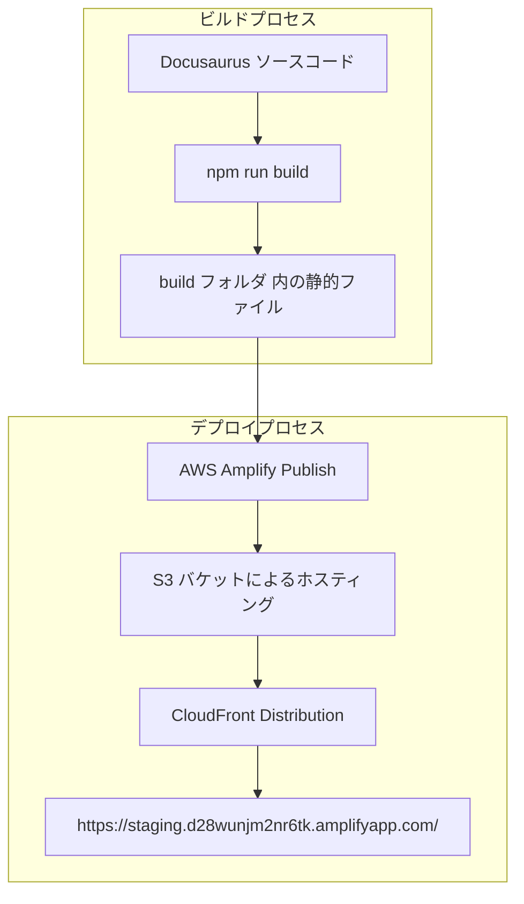

# Project: my-website-secure

```plaintext
OS: posix
Directory: /home/maki/prj/docusaurus/my-website-secure

├── blog/
│   ├── 2021-08-26-welcome/
│   │   └── docusaurus-plushie-banner.jpeg
│   ├── 2025/
│   │   └── 02/
│   │       └── 04/
│   │           ├── 2025-02-04-artificial-intelligence-ethics.md
│   │           ├── 2025-02-04-aws-amplify-best-practices.md
│   │           ├── 2025-02-04-aws-amplify-deployment-tips.md
│   │           ├── 2025-02-04-data-science-insights.md
│   │           ├── 2025-02-04-machine-learning-applications.md
│   │           └── 2025-02-04-obility-30year-future-business-analysis-report.md
│   ├── authors.yml
│   └── tags.yml
├── docs/
│   ├── tutorial-basics/
│   │   ├── _category_.json
│   │   ├── congratulations.md
│   │   ├── create-a-blog-post.md
│   │   ├── create-a-document.md
│   │   ├── create-a-page.md
│   │   ├── deploy-your-site.md
│   │   └── markdown-features.mdx
│   ├── tutorial-extras/
│   │   ├── img/
│   │   ├── _category_.json
│   │   ├── manage-docs-versions.md
│   │   └── translate-your-site.md
│   └── intro.md
├── scripts/
│   └── deploy.sh
├── src/
│   ├── components/
│   │   └── HomepageFeatures/
│   │       ├── index.tsx
│   │       └── styles.module.css
│   ├── css/
│   │   └── custom.css
│   └── pages/
│       ├── about/
│       │   ├── index.tsx
│       │   └── styles.module.css
│       └── markdown-page.md
├── static/
│   ├── img/
│   │   ├── favicon.ico
│   └── .nojekyll
├── .SourceSageignore
├── amplify.yml
├── amplify_outputs.json
├── build.zip
├── docusaurus.config.ts
├── package.json
├── README.md
├── sidebars.ts
└── tsconfig.json
```

## 📂 Gitリポジトリ情報

### 🌐 基本情報

- 🔗 リモートURL: https://github.com/Sunwood-ai-labs/Amplify-Docusaurus-Starter.git
- 🌿 デフォルトブランチ: main
- 🎯 現在のブランチ: main
- 📅 作成日時: 2025-02-05 14:52:01
- 📈 総コミット数: 4

### 🔄 最新のコミット

- 📝 メッセージ: 🚀 feat: #0: README更新 - ヘッダー画像の変更
- 🔍 ハッシュ: a2743733
- 👤 作者: Maki (sunwood.ai.labs@gmail.com)
- ⏰ 日時: 2025-02-04 23:45:29

### 👥 主要コントリビューター

| 👤 名前 | 📊 コミット数 |
|---------|-------------|
| Maki | 4 |

## 📊 プロジェクト統計

- 📅 作成日時: 2025-02-05 18:25:49
- 📁 総ディレクトリ数: 18
- 📄 総ファイル数: 38
- 📏 最大深度: 4
- 📦 最大ディレクトリ:  (56 エントリ)

### 📊 ファイルサイズと行数

| ファイル | サイズ | 行数 | 言語 |
|----------|--------|------|------|
| build.zip | 1.5 MB | 0 | plaintext |
| blog/2021-08-26-welcome/docusaurus-plushie-banner.jpeg | 93.9 KB | 0 | plaintext |
| blog/2025/02/04/2025-02-04-obility-30year-future-business-analysis-report.md | 58.6 KB | 176 | markdown |
| README.md | 6.6 KB | 188 | markdown |
| docusaurus.config.ts | 4.3 KB | 157 | typescript |
| static/img/favicon.ico | 3.5 KB | 0 | plaintext |
| docs/tutorial-basics/markdown-features.mdx | 2.9 KB | 152 | plaintext |
| src/css/custom.css | 2.1 KB | 79 | css |
| blog/2025/02/04/2025-02-04-aws-amplify-deployment-tips.md | 2.0 KB | 42 | markdown |
| src/components/HomepageFeatures/index.tsx | 1.9 KB | 73 | plaintext |
| blog/2025/02/04/2025-02-04-aws-amplify-best-practices.md | 1.9 KB | 35 | markdown |
| blog/tags.yml | 1.7 KB | 59 | yaml |
| docs/tutorial-extras/translate-your-site.md | 1.5 KB | 88 | markdown |
| package.json | 1.4 KB | 55 | json |
| scripts/deploy.sh | 1.4 KB | 40 | bash |
| docs/intro.md | 1.4 KB | 47 | markdown |
| node_modules/fastq/.github/workflows/ci.yml | 1.4 KB | 75 | yaml |
| node_modules/fast-uri/.github/workflows/ci.yml | 1.3 KB | 58 | yaml |
| src/pages/about/index.tsx | 1.2 KB | 40 | plaintext |
| blog/authors.yml | 1.2 KB | 40 | yaml |
| docs/tutorial-extras/manage-docs-versions.md | 1.2 KB | 55 | markdown |
| amplify_outputs.json | 1.1 KB | 47 | json |
| docs/tutorial-basics/congratulations.md | 1.1 KB | 23 | markdown |
| docs/tutorial-basics/create-a-document.md | 1.0 KB | 57 | markdown |
| blog/2025/02/04/2025-02-04-artificial-intelligence-ethics.md | 1.0 KB | 22 | markdown |
| docs/tutorial-basics/create-a-page.md | 1015.0 B | 43 | markdown |
| docs/tutorial-basics/create-a-blog-post.md | 886.0 B | 34 | markdown |
| node_modules/@ungap/structured-clone/.github/workflows/node.js.yml | 872.0 B | 31 | yaml |
| sidebars.ts | 860.0 B | 33 | typescript |
| blog/2025/02/04/2025-02-04-data-science-insights.md | 759.0 B | 22 | markdown |
| blog/2025/02/04/2025-02-04-machine-learning-applications.md | 741.0 B | 22 | markdown |
| docs/tutorial-basics/deploy-your-site.md | 702.0 B | 31 | markdown |
| node_modules/json-schema-traverse/.github/workflows/publish.yml | 678.0 B | 27 | yaml |
| node_modules/aws-cdk-lib/node_modules/json-schema-traverse/.github/workflows/publish.yml | 678.0 B | 27 | yaml |
| .SourceSageignore | 644.0 B | 53 | plaintext |
| node_modules/json-schema-traverse/.github/workflows/build.yml | 582.0 B | 28 | yaml |
| node_modules/aws-cdk-lib/node_modules/json-schema-traverse/.github/workflows/build.yml | 582.0 B | 28 | yaml |
| node_modules/busboy/.github/workflows/ci.yml | 518.0 B | 24 | yaml |
| node_modules/streamsearch/.github/workflows/ci.yml | 509.0 B | 24 | yaml |
| node_modules/pretty-error/.github/workflows/main.yml | 481.0 B | 25 | yaml |
| node_modules/busboy/.github/workflows/lint.yml | 471.0 B | 23 | yaml |
| node_modules/streamsearch/.github/workflows/lint.yml | 471.0 B | 23 | yaml |
| node_modules/wildcard/.github/workflows/build.yml | 459.0 B | 24 | yaml |
| amplify.yml | 446.0 B | 24 | yaml |
| node_modules/aws-cdk-lib/node_modules/fast-uri/.github/workflows/ci.yml | 371.0 B | 23 | yaml |
| node_modules/aws-cdk-lib/node_modules/fast-uri/.github/workflows/package-manager-ci.yml | 319.0 B | 20 | yaml |
| node_modules/fast-uri/.github/workflows/package-manager-ci.yml | 315.0 B | 20 | yaml |
| src/pages/about/styles.module.css | 294.0 B | 20 | css |
| tsconfig.json | 215.0 B | 8 | json |
| docs/tutorial-basics/_category_.json | 180.0 B | 8 | json |
| src/components/HomepageFeatures/styles.module.css | 138.0 B | 11 | css |
| src/pages/markdown-page.md | 118.0 B | 7 | markdown |
| docs/tutorial-extras/_category_.json | 99.0 B | 7 | json |
| static/.nojekyll | 0.0 B | 0 | plaintext |
| **合計** |  | **2278** |  |

### 📈 言語別統計

| 言語 | ファイル数 | 総行数 | 合計サイズ |
|------|------------|--------|------------|
| markdown | 16 | 892 | 80.5 KB |
| yaml | 19 | 603 | 13.1 KB |
| plaintext | 8 | 318 | 1.6 MB |
| typescript | 2 | 190 | 5.2 KB |
| json | 5 | 125 | 3.0 KB |
| css | 3 | 110 | 2.5 KB |
| bash | 1 | 40 | 1.4 KB |

`.SourceSageignore`

**サイズ**: 644.0 B | **行数**: 53 行
```plaintext
# バージョン管理システム関連
.git/
.gitignore

# キャッシュファイル
__pycache__/
.pytest_cache/
**/__pycache__/**
*.pyc

# ビルド・配布関連
build/
dist/
*.egg-info/

# 一時ファイル・出力
output/
output.md
test_output/
.SourceSageAssets/
.SourceSageAssetsDemo/

# アセット
*.png
*.svg
*.jpg
*.jepg
assets/

# その他
LICENSE
example/
package-lock.json
.DS_Store

# 特定のディレクトリを除外
tests/temp/
docs/drafts/

# パターンの例外（除外対象から除外）
!docs/important.md
!.github/workflows/
repository_summary.md

venv
.venv

.docusaurus

node_modules

.amplify/
amplify
```

`README.md`

**サイズ**: 6.6 KB | **行数**: 188 行
```markdown
<div align="center">


# 🚀 Amplify-Docusaurus-Starter


[](https://aws.amazon.com/amplify/)
[](https://docusaurus.io/)

🔥🚀 このスターターキットは、最新のAWS Amplify Gen2とDocusaurusを組み合わせ、効率的な開発とデプロイを実現します！

</div>


## 💡 概要
本リポジトリは、AWS Amplify Gen2とDocusaurusを組み合わせた静的サイトのスターターキットです。
AWS Amplify Gen2は、従来のAmplifyフレームワークを進化させ、より高速で柔軟なインフラストラクチャ管理を実現します。

### 🌟 AWS Amplify Gen2の特徴

- **TypeScriptネイティブ**: インフラストラクチャをTypeScriptで定義
- **高速なデプロイ**: 最適化されたデプロイプロセス
- **柔軟なカスタマイズ**: AWS CDKとの完全な互換性
- **改善されたローカル開発**: 強化されたサンドボックス環境
- **セキュリティ強化**: よりきめ細かいIAM権限管理

## 📥 インストール

```bash
npm install
```

## 💻 ローカル開発

```bash
npm run start
```

このコマンドは、ローカル開発サーバーを起動し、ブラウザウィンドウを開きます。変更はリアルタイムに反映されます。

## 🔨 ビルド

```bash
npm run build
```

このコマンドで、静的コンテンツが `build` ディレクトリに生成されます。

## 🛡️ セキュリティ設定

このプロジェクトは、AWS Amplifyのデフォルトのセキュリティ設定を使用しています。

## 🚀 デプロイ

### 🌐 デプロイ先URL

本サイトは以下のURLでホストされています：
https://staging.d28wunjm2nr6tk.amplifyapp.com/

### 📦 デプロイスクリプトを使用したデプロイ

このプロジェクトには、デプロイを自動化するスクリプトが用意されています：

```bash
# デプロイスクリプトを実行
./scripts/deploy.sh
```

このスクリプトは以下の処理を自動的に行います：
1. プロジェクトのビルド
2. ビルドファイルのZIP化
3. S3バケットの作成（存在しない場合）
4. ビルドファイルのS3へのアップロード

スクリプト実行後は、表示される手順に従ってAWS Amplifyコンソールでデプロイを完了させてください。

### 🛠️ 手動デプロイ

手動でデプロイを行う場合は、以下の手順に従ってください：

### 📦 AWS Amplify Gen2を使用したデプロイ

#### 1. ローカル開発環境の確認
```bash
# Amplifyの設定を確認
npx ampx info

# サンドボックスモードでテスト
npx ampx sandbox
```

#### 2. ビルドとパッケージング
```bash
# プロジェクトのビルド
npm run build

# ビルドファイルのZIP化
cd build && zip -r ../build.zip .
cd ..
```

#### 3. S3バケットの作成とアップロード
```bash
# S3バケットの作成
aws s3api create-bucket \
  --bucket my-website-secure-deploy \
  --create-bucket-configuration LocationConstraint=ap-northeast-1

# ビルドファイルのアップロード
aws s3 cp build.zip s3://my-website-secure-deploy/
```

#### 4. AWS Amplifyでのデプロイ

1. [AWS Amplifyコンソール](https://ap-northeast-1.console.aws.amazon.com/amplify/home)にアクセス
2. プロジェクト「my-website-secure」を選択
3. 「ホスティング」タブを選択
4. 「main」ブランチを選択
5. 「デプロイ」ボタンをクリック
6. 「ソースファイル」で「Amazon S3」を選択
7. S3のURL `s3://my-website-secure-deploy/build.zip` を入力
8. 「保存してデプロイ」をクリック

#### 5. クリーンアップ（オプション）
```bash
# S3のファイルを削除
aws s3 rm s3://my-website-secure-deploy/build.zip
```

### 📝 注意事項

- デプロイ前に必ず `npx ampx sandbox` でローカルテストを実行してください
- AWS認証情報が正しく設定されていることを確認してください
- S3バケット名は一意である必要があります
- デプロイ後、[Amplifyコンソール](https://ap-northeast-1.console.aws.amazon.com/amplify/home)でステータスを確認できます

## 🏗️ アーキテクチャ



※ 本サイトは、AWS Amplify による自動デプロイと CloudFront を用いた静的ファイル配信で運用されています。

## ❌ AWS Amplify の削除方法

AWS Amplify のリソースを削除する方法は以下の 2 つがあります。

### 1. AWS Amplify CLI を使った削除

プロジェクトのルートディレクトリで以下のコマンドを実行してください。

```
amplify delete
```

このコマンドは、プロジェクトに関連する全てのバックエンドリソースと Amplify App 自体を削除します。コマンド実行後、削除対象リソースの確認や最終確認のプロンプトが表示されるので、慎重に内容を確認してください。

### 2. AWS Amplify コンソールからの削除

1. AWS マネジメントコンソールにログインし、【Amplify コンソール】を開きます。
2. 削除したい Amplify App を選択します。
3. 設定メニューまたは画面右上のオプションから「App の削除」または「削除」を選択します。
4. 表示される確認プロンプトに従い、削除処理を進めます。

**注意:** 
- 一度削除するとリソースは復元できません。削除前に必要なバックアップがあるかどうかを十分に確認してください。
- WAFの設定を削除する場合は、CloudFormationスタックも個別に削除する必要があります。
```

`amplify.yml`

**サイズ**: 446.0 B | **行数**: 24 行
```yaml
version: 1
backend:
  phases:
    build:
      commands:
        - npm ci --cache .npm --prefer-offline
        - npx ampx pipeline-deploy --branch $AWS_BRANCH --app-id $AWS_APP_ID
frontend:
  phases:
    preBuild:
      commands:
        - npm ci
    build:
      commands:
        - npm run build
  artifacts:
    baseDirectory: build
    files:
      - '**/*'
  cache:
    paths:
      - build/**/*
      - .npm/**/*
      - node_modules/**/*
```

`amplify_outputs.json`

**サイズ**: 1.1 KB | **行数**: 47 行
```json
{
  "auth": {
    "user_pool_id": "ap-northeast-1_35PqH50rq",
    "aws_region": "ap-northeast-1",
    "user_pool_client_id": "5bvouf5g7fcq9gfu3o6q7h8ibt",
    "identity_pool_id": "ap-northeast-1:9200723f-07a0-465a-9df1-ebe4957c2ab2",
    "mfa_methods": [],
    "standard_required_attributes": [
      "email"
    ],
    "username_attributes": [
      "email"
    ],
    "user_verification_types": [
      "email"
    ],
    "groups": [],
    "mfa_configuration": "NONE",
    "password_policy": {
      "min_length": 8,
      "require_lowercase": true,
      "require_numbers": true,
      "require_symbols": true,
      "require_uppercase": true
    },
    "oauth": {
      "identity_providers": [],
      "redirect_sign_in_uri": [
        "http://localhost:3000"
      ],
      "redirect_sign_out_uri": [
        "http://localhost:3000"
      ],
      "response_type": "code",
      "scopes": [
        "phone",
        "email",
        "openid",
        "profile",
        "aws.cognito.signin.user.admin"
      ],
      "domain": "9125678326ef65c62026.auth.ap-northeast-1.amazoncognito.com"
    },
    "unauthenticated_identities_enabled": true
  },
  "version": "1.3"
}
```

`build.zip` - Binary file

`docusaurus.config.ts`

**サイズ**: 4.3 KB | **行数**: 157 行
```typescript
import {themes as prismThemes} from 'prism-react-renderer';
import type {Config} from '@docusaurus/types';
import type * as Preset from '@docusaurus/preset-classic';

// This runs in Node.js - Don't use client-side code here (browser APIs, JSX...)

const config: Config = {
  title: 'My Site',
  tagline: 'Dinosaurs are cool',
  favicon: 'img/cat1.svg',

  // Set the production url of your site here
  url: 'https://staging.d28wunjm2nr6tk.amplifyapp.com',
  // Set the /<baseUrl>/ pathname under which your site is served
  baseUrl: '/',
  trailingSlash: true,

  // GitHub pages deployment config.
  // If you aren't using GitHub pages, you don't need these.
  organizationName: 'Sunwood-ai-labs', // Usually your GitHub org/user name.
  projectName: 'Amplify-Docusaurus-Starter', // Usually your repo name.

  onBrokenLinks: 'throw',
  onBrokenMarkdownLinks: 'warn',

  // Even if you don't use internationalization, you can use this field to set
  // useful metadata like html lang. For example, if your site is Chinese, you
  // may want to replace "en" with "zh-Hans".
  i18n: {
    defaultLocale: 'en',
    locales: ['en'],
  },

  presets: [
    [
      'classic',
      {
        docs: {
          sidebarPath: './sidebars.ts',
          // Please change this to your repo.
          // Remove this to remove the "edit this page" links.
          editUrl:
            'https://github.com/Sunwood-ai-labs/Amplify-Docusaurus-Starter/tree/main/packages/create-docusaurus/templates/shared/',
        },
        blog: {
          showReadingTime: true,
          // ブログをトップページに設定
          routeBasePath: '/',
          // サイドバーに表示する記事数を増やす
          blogSidebarCount: 'ALL',
          blogSidebarTitle: '全ての記事',
          feedOptions: {
            type: ['rss', 'atom'],
            xslt: true,
          },
          // Please change this to your repo.
          // Remove this to remove the "edit this page" links.
          editUrl:
            'https://github.com/Sunwood-ai-labs/Amplify-Docusaurus-Starter/tree/main/packages/create-docusaurus/templates/shared/',
          // Useful options to enforce blogging best practices
          onInlineTags: 'warn',
          onInlineAuthors: 'warn',
          onUntruncatedBlogPosts: 'warn',
        },
        theme: {
          customCss: './src/css/custom.css',
        },
      } satisfies Preset.Options,
    ],
  ],

  themeConfig: {
    // Replace with your project's social card
    image: 'img/cat1.svg',
    navbar: {
      title: 'My Site',
      logo: {
        alt: 'My Site Logo',
        src: 'img/cat1.svg',
      },
      items: [
        {
          type: 'docSidebar',
          sidebarId: 'tutorialSidebar',
          position: 'left',
          label: 'Tutorial',
        },
        {
          to: '/about',
          label: 'About Us',
          position: 'left',
        },
        {
          to: '/tags',
          label: 'Tags',
          position: 'left',
        },
        {
          href: 'https://github.com/Sunwood-ai-labs/Amplify-Docusaurus-Starter',
          label: 'GitHub',
          position: 'right',
        },
      ],
    },
    footer: {
      style: 'dark',
      links: [
        {
          title: 'Docs',
          items: [
            {
              label: 'Tutorial',
              to: '/docs/intro',
            },
          ],
        },
        {
          title: 'Community',
          items: [
            {
              label: 'Stack Overflow',
              href: 'https://stackoverflow.com/questions/tagged/docusaurus',
            },
            {
              label: 'Discord',
              href: 'https://discordapp.com/invite/docusaurus',
            },
            {
              label: 'X',
              href: 'https://x.com/docusaurus',
            },
          ],
        },
        {
          title: 'More',
          items: [
            {
              label: 'Blog',
              to: '/blog',
            },
            {
              label: 'GitHub',
              href: 'https://github.com/Sunwood-ai-labs/Amplify-Docusaurus-Starter',
            },
          ],
        },
      ],
      copyright: `Copyright ${new Date().getFullYear()} My Project, Inc. Built with Docusaurus.`,
    },
    prism: {
      theme: prismThemes.github,
      darkTheme: prismThemes.dracula,
    },
  } satisfies Preset.ThemeConfig,
};

export default config;
```

`package.json`

**サイズ**: 1.4 KB | **行数**: 55 行
```json
{
  "name": "my-website",
  "version": "0.0.0",
  "private": true,
  "scripts": {
    "docusaurus": "docusaurus",
    "start": "docusaurus start",
    "build": "docusaurus build",
    "swizzle": "docusaurus swizzle",
    "deploy": "GIT_USER=Sunwood-ai-labs docusaurus deploy",
    "clear": "docusaurus clear",
    "serve": "docusaurus serve",
    "write-translations": "docusaurus write-translations",
    "write-heading-ids": "docusaurus write-heading-ids",
    "typecheck": "tsc"
  },
  "dependencies": {
    "@docusaurus/core": "3.7.0",
    "@docusaurus/preset-classic": "3.7.0",
    "@mdx-js/react": "^3.0.0",
    "aws-amplify": "^6.12.3",
    "clsx": "^2.0.0",
    "prism-react-renderer": "^2.3.0",
    "react": "^19.0.0",
    "react-dom": "^19.0.0"
  },
  "devDependencies": {
    "@aws-amplify/backend": "^1.14.0",
    "@aws-amplify/backend-cli": "^1.4.9",
    "@docusaurus/module-type-aliases": "3.7.0",
    "@docusaurus/tsconfig": "3.7.0",
    "@docusaurus/types": "3.7.0",
    "aws-cdk": "^2.177.0",
    "aws-cdk-lib": "^2.177.0",
    "constructs": "^10.4.2",
    "esbuild": "^0.24.2",
    "tsx": "^4.19.2",
    "typescript": "^5.7.3"
  },
  "browserslist": {
    "production": [
      ">0.5%",
      "not dead",
      "not op_mini all"
    ],
    "development": [
      "last 3 chrome version",
      "last 3 firefox version",
      "last 5 safari version"
    ]
  },
  "engines": {
    "node": ">=18.0"
  }
}
```

`sidebars.ts`

**サイズ**: 860.0 B | **行数**: 33 行
```typescript
import type {SidebarsConfig} from '@docusaurus/plugin-content-docs';

// This runs in Node.js - Don't use client-side code here (browser APIs, JSX...)

/**
 * Creating a sidebar enables you to:
 - create an ordered group of docs
 - render a sidebar for each doc of that group
 - provide next/previous navigation

 The sidebars can be generated from the filesystem, or explicitly defined here.

 Create as many sidebars as you want.
 */
const sidebars: SidebarsConfig = {
  // By default, Docusaurus generates a sidebar from the docs folder structure
  tutorialSidebar: [{type: 'autogenerated', dirName: '.'}],

  // But you can create a sidebar manually
  /*
  tutorialSidebar: [
    'intro',
    'hello',
    {
      type: 'category',
      label: 'Tutorial',
      items: ['tutorial-basics/create-a-document'],
    },
  ],
   */
};

export default sidebars;
```

`tsconfig.json`

**サイズ**: 215.0 B | **行数**: 8 行
```json
{
  // This file is not used in compilation. It is here just for a nice editor experience.
  "extends": "@docusaurus/tsconfig",
  "compilerOptions": {
    "baseUrl": "."
  },
  "exclude": [".docusaurus", "build"]
}
```

`static/.nojekyll`

**サイズ**: 0.0 B | **行数**: 0 行
```plaintext
(Empty file)
```

`static/img/favicon.ico` - Binary file

`scripts/deploy.sh`

**サイズ**: 1.4 KB | **行数**: 40 行
```bash
#!/bin/bash

# エラーが発生したら即座に終了
set -e

# 環境変数の設定
BUCKET_NAME="my-website-secure-deploy"
REGION="ap-northeast-1"

echo "🚀 デプロイを開始します..."

# ビルド
echo "📦 プロジェクトをビルドしています..."
npm run build

# buildディレクトリに移動してZIP化
echo "🗜️ ビルドファイルをZIP化しています..."
cd build && zip -r ../build.zip . && cd ..

# S3バケットの存在確認
if ! aws s3 ls "s3://$BUCKET_NAME" 2>&1 > /dev/null; then
  echo "🪣 S3バケットを作成しています..."
  aws s3api create-bucket \
    --bucket $BUCKET_NAME \
    --create-bucket-configuration LocationConstraint=$REGION
fi

# ビルドファイルのアップロード
echo "📤 S3にファイルをアップロードしています..."
aws s3 cp build.zip "s3://$BUCKET_NAME/"

echo "✨ デプロイが完了しました！"
echo "🌐 AWS Amplifyコンソールで残りの手順を実行してください："
echo "1. https://ap-northeast-1.console.aws.amazon.com/amplify/home にアクセス"
echo "2. プロジェクト「my-website-secure」を選択"
echo "3. 「ホスティング」タブを選択"
echo "4. 「main」ブランチを選択"
echo "5. 「デプロイ」ボタンをクリック"
echo "6. S3のURL: s3://$BUCKET_NAME/build.zip を入力"
echo "7. 「保存してデプロイ」をクリック"
```

`blog/authors.yml`

**サイズ**: 1.2 KB | **行数**: 40 行
```yaml
yangshun:
  name: Yangshun Tay
  title: Docusaurus コア開発者
  url: https://github.com/yangshun
  image_url: https://github.com/yangshun.png
  page: true
  socials:
    x: yangshunz
    github: yangshun

slorber:
  name: Sébastien Lorber
  title: Docusaurus メンテナー
  url: https://sebastienlorber.com
  image_url: https://github.com/slorber.png
  page:
    # customize the url of the author page at /blog/authors/<permalink>
    permalink: '/all-sebastien-lorber-articles'
  socials:
    x: sebastienlorber
    linkedin: sebastienlorber
    github: slorber
    newsletter: https://thisweekinreact.com

maki:
  name: Maki
  title: リードエンジニア @ Sunwood AI Labs
  url: https://github.com/Sunwood-ai-labs
  image_url: https://github.com/Sunwood-ai-labs.png
  email: sunwood.ai.labs@gmail.com
  twitter: sunwood_ai_labs
  description: |
    AIとクラウドテクノロジーの専門家。AWS認定ソリューションアーキテクト。
    DocusaurusとAWS Amplifyを使用した最新のウェブ開発に情熱を注いでいます。
  page:
    # customize the url of the author page at /blog/authors/<permalink>
    permalink: '/all-maki-maki-articles'
  socials:
    x: hAru_mAki_ch
    github: Sunwood-ai-labs
```

`blog/tags.yml`

**サイズ**: 1.7 KB | **行数**: 59 行
```yaml
artificial-intelligence:
  label: AI
  permalink: /tags/ai
  description: 人工知能に関する最新のトレンドと実践的な応用について

cloud:
  label: クラウド
  permalink: /tags/cloud
  description: AWSやクラウドコンピューティングに関する技術情報

ethics:
  label: 倫理
  permalink: /tags/ethics
  description: テクノロジーの倫理的な課題と解決策について

best-practices:
  label: ベストプラクティス
  permalink: /tags/best-practices
  description: 効率的な開発・運用のためのベストプラクティス集

deployment:
  label: デプロイ
  permalink: /tags/deployment
  description: AWS Amplifyを使用したデプロイメントのガイド

tips:
  label: TIPS
  permalink: /tags/tips
  description: 開発者向けの実践的なヒントとテクニック

data-science:
  label: データサイエンス
  permalink: /tags/data-science
  description: データ分析と機械学習の実践的な応用

trends:
  label: トレンド
  permalink: /tags/trends
  description: テクノロジー業界の最新動向と将来予測

machine-learning:
  label: 機械学習
  permalink: /tags/machine-learning
  description: 機械学習アルゴリズムと実装について

applications:
  label: アプリケーション
  permalink: /tags/applications
  description: 実世界での技術応用事例

docusaurus:
  label: Docusaurus
  permalink: /tags/docusaurus
  description: Docusaurusを使用したドキュメント作成とサイト構築

aws-amplify:
  label: AWS Amplify
  permalink: /tags/aws-amplify
  description: AWS Amplifyを使用したウェブアプリケーション開発
```

`blog/2021-08-26-welcome/docusaurus-plushie-banner.jpeg` - Binary file

`blog/2025/02/04/2025-02-04-artificial-intelligence-ethics.md`

**サイズ**: 1.0 KB | **行数**: 22 行
```markdown
---
slug: artificial-intelligence-ethics
title: 人工知能の倫理と課題
authors: [maki]
tags: [AI, ethics]
date: 2025-02-04
excerpt: "人工知能技術の急速な進化に伴う倫理的問題とその解決策について議論します。"
---

## はじめに

人工知能（AI）の進化は、私たちの社会に多大な影響を与えています。しかし、その急速な発展に伴い、倫理的な問題や課題も数多く生じています。本記事では、AIの倫理に関する主要な論点と、それに対する解決策について考察します。

## 主な論点

- プライバシー保護とデータ利用の透明性
- バイアスと公平性の確保
- 人間とAIの共生に向けたガイドライン

## 結論

AI技術の発展には多くの可能性が秘められていますが、同時に解決すべき重要な倫理的課題も存在します。これらの課題に対して社会全体で取り組むことが、持続可能な技術活用の鍵となるでしょう。
```

`blog/2025/02/04/2025-02-04-aws-amplify-best-practices.md`

**サイズ**: 1.9 KB | **行数**: 35 行
```markdown
---
slug: aws-amplify-best-practices
title: AWS Amplifyのベストプラクティスと活用方法
authors: [maki]
tags: [AWS Amplify, best practices, cloud]
date: 2025-02-04
excerpt: "Amplifyを使った効果的な開発・運用方法と、クラウドリソースの最適利用法について解説します。"
---

## はじめに

AWS Amplifyは、モダンなウェブアプリケーションやモバイルアプリケーションの開発・運用を加速するプラットフォームです。本記事では、Amplifyを最大限に活用するためのベストプラクティスを紹介します。

## 効果的な開発方法

- **CLIの活用**  
  Amplify CLIを使用すると、簡単にバックエンドリソース（例：GraphQL API、認証、ストレージ）を設定でき、迅速なプロトタイピングが可能です。

- **環境ごとの設定管理**  
  開発、ステージング、本番環境ごとに設定を分けることで、各環境に最適なリソース管理が実現できます。

## 運用上のベストプラクティス

- **自動化されたCI/CDパイプライン**  
  Amplify Consoleを利用して、Gitの変更が自動的にビルドおよびデプロイされる仕組みを整備しましょう。

- **パフォーマンス最適化**  
  キャッシュポリシーの設定や、CDN（Content Delivery Network）の利用により、ユーザー体験を向上させることができます。

- **セキュリティ対策**  
  環境変数の適切な管理や、アクセス制御を徹底して、セキュリティリスクを最小限に抑えましょう。

## まとめ

AWS Amplifyのベストプラクティスを取り入れることで、開発と運用の効率が大幅に向上します。継続的な改善と最新の技術動向の取り入れが、成功するプロジェクトの鍵となります。
```

`blog/2025/02/04/2025-02-04-aws-amplify-deployment-tips.md`

**サイズ**: 2.0 KB | **行数**: 42 行
```markdown
---
slug: aws-amplify-deployment-tips
title: AWS Amplifyを活用したデプロイのヒント
authors: [maki]
tags: [AWS Amplify, deployment, tips]
date: 2025-02-04
excerpt: "AWS Amplifyを用いたデプロイの基本手順と、よくある問題への対処法について解説します。"
---

## はじめに

AWS Amplifyは、フロントエンドとバックエンドの開発・運用をシンプルにするためのサービスです。本記事では、Amplifyを活用してサイトをデプロイする際の基本手順とトラブルシューティングのポイントを紹介します。

## デプロイの基本手順

1. **プロジェクトの準備**  
   Amplify CLIを使ってプロジェクトを初期化し、必要なバックエンドリソース（例：認証、ストレージなど）を設定します。

2. **ビルドとデプロイ**  
   ```bash
   npm run build
   amplify publish
   ```
   ビルドコマンドで静的ファイルを生成し、その成果物をAmplifyにアップロードしてデプロイします。

3. **継続的デプロイ（CI/CD）の設定**  
   Amplify Consoleを利用して、Gitリポジトリに変更があった場合に自動でビルド・デプロイを行うことができます。

## トラブルシューティングのポイント

- **キャッシュのクリア**  
  デプロイ後にサイトが正しく反映されない場合は、Amplify Consoleやブラウザのキャッシュをクリアしてください。

- **環境変数の確認**  
  デプロイ時に使用する環境変数が正しく設定されているか確認しましょう。

- **ログの確認**  
  Amplify Consoleでビルドログやデプロイログを確認することで、エラーの原因を特定できます。

## まとめ

AWS Amplifyは、迅速なデプロイと運用を実現するための強力なツールです。基本手順とトラブルシューティングのポイントを押さえることで、スムーズなデプロイが可能になります。
```

`blog/2025/02/04/2025-02-04-data-science-insights.md`

**サイズ**: 759.0 B | **行数**: 22 行
```markdown
---
slug: data-science-insights
title: データサイエンスの未来展望
authors: [maki]
tags: [data science, trends]
date: 2025-02-04
excerpt: "データサイエンスの新たな潮流とその影響力について考察します。"
---

## はじめに

データサイエンスは、現代のビジネスや研究の現場で不可欠な技術となっています。本記事では、最新の技術動向や今後の展望について詳しく解説します。

## 主なトピック

- 最新のアルゴリズムと技術革新
- ビッグデータ解析の実用例
- データ倫理とプライバシー問題

## 結論

これからもデータサイエンスの発展が期待され、様々な業界での活用が進むでしょう。
```

`blog/2025/02/04/2025-02-04-machine-learning-applications.md`

**サイズ**: 741.0 B | **行数**: 22 行
```markdown
---
slug: machine-learning-applications
title: 機械学習の実践的応用
authors: [maki]
tags: [machine learning, applications]
date: 2025-02-04
excerpt: "機械学習が様々な分野で活用される具体例とその効果を探ります。"
---

## はじめに

機械学習は、医療、製造業、金融など、さまざまな分野で実践的な応用が進んでいます。本記事では、具体的な事例とその成果について考察します。

## 主な応用例

- 画像認識と自然言語処理
- 異常検知と予測保守
- パーソナライズドマーケティング

## まとめ

実世界での応用事例は今後も増え続け、産業全体に大きな変革をもたらすでしょう。
```

`blog/2025/02/04/2025-02-04-obility-30year-future-business-analysis-report.md`

**サイズ**: 58.6 KB | **行数**: 176 行
```markdown
---
slug: mobility-30year-future-business-analysis-report
title: "今後30年のモビリティ未来展望: ビジネス向け詳細分析レポート"
authors: [maki]
tags: [mobility, ev, autonomous-driving, future-forecast, business-analysis, market-research]
date: 2025-02-04
excerpt: "今後30年のモビリティ未来展望: ビジネス向け詳細分析レポート"
---

:::caution

OpenAI Deep Research で作成されています

:::

## 1. 市場規模・成長予測

**電気自動車（EV）市場**: 電動車市場は今後数十年にわたり爆発的な成長が見込まれています。2020年時点で約1,630億ドル規模だった世界のEV市場は、2030年までに8,237億ドルに達すると予測されていますこれにより2021年から2030年の年平均成長率（CAGR）は約18.2%となり、急速な拡大が続く見通しです販売台数ベースでも、世界の新車販売に占めるEV比率は2023年の約15%から2030年には40%前後に達する可能性があります各国政府の環境規制強化やバッテリーコスト低下がこの成長を後押ししています。

**自動運転車（AV）市場**: 自動運転技術市場も巨大な潜在性を秘めています。世界の自動運転車関連市場規模は2030年に1,348億ドル、2040年には9,807億ドルに達する見通しで、2030年代に年率22.3%という高成長が予測されています特に完全自動運転（レベル4/5）の商用化は当初想定より遅れつつあるものの、2030年頃までに大規模なロボタクシーサービスが登場するとの見方があります一方、自動運転トラックや物流への応用も2028～2031年に実用化されるとの予測があり、輸送産業での変革も進行しています

**MaaS（Mobility as a Service）市場**: MaaSとは、乗用車の所有に代わり、複数の交通手段を統合したサービスを提供する概念で、これも高成長が期待される分野です。2024年時点で約1,923億ドルと推定されるグローバルMaaS市場は、2030年には5,196億ドル規模に拡大する見通しで、年平均成長率は約18%に達するとされています別の推計では2030年に5,000億ユーロ（約5,500億ドル）規模に達するとの分析もあり自動運転車の普及に伴ってライドシェアやシャトルサービスが飛躍的に伸びると見られます。

**空飛ぶクルマ（eVTOL・空中モビリティ）市場**: 現時点では実証段階ながら、長期的な市場ポテンシャルは極めて大きいと指摘されています。米モルガン・スタンレーの試算によれば、都市型空飛ぶクルマ・エアタクシーの市場規模は2040年に1.5兆ドルに達し得るとの予測があります2030年までの短期では規制整備や技術実証が中心となりますが、早ければ2020年代後半から一部で商用サービス開始の可能性があります。例えばパリや大阪では2024～2025年に実証飛行を行い、2030年前後には限定ルートでのエアタクシー運航を目指す計画があります。空飛ぶクルマ市場は30年スパンで見ると「静かな立ち上がりから急成長」への転換期に差しかかるでしょう。

**その他新領域**: この他、マイクロモビリティ（電動キックボードや自転車シェア）、商用ドローン配送、市民向け高速鉄道・ハイパーループといったモビリティ新領域でも成長が見込まれます。例えば電動キックボードや電動自転車などのミクロモビリティ市場は2030年に3,600億ドル規模に拡大するとの試算もあり（2022年時点1,750億ドルから倍増以上、都市部の移動需要に応じて多様なモビリティサービスが市場を拡大させるでしょう。

## 2. 主要プレイヤー・競争環境

**電気自動車分野**: EV市場では**テスラ (Tesla)**が依然として先行者優位を保っています。テスラは乗用車EVで世界販売トップクラスを維持し、高性能バッテリー技術や充電インフラ（スーパーチャージャーネットワーク）で強みを発揮しています。また、中国の**BYD**はプラグインハイブリッド(PHEV)とEVを合わせた「NEV」販売で世界一となる勢いで急成長しており、政府支援を背景に生産規模とコスト競争力で台頭しています。伝統自動車メーカーでは、**フォルクスワーゲン(VW)**や**ゼネラルモーターズ(GM)**、**トヨタ自動車**などが数十億～数百億ドル単位の巨額投資計画を表明し（例えばGMは2025年までに350億ドル投資計画、EVラインアップ拡充と生産転換を加速しています。各社とも2030年頃までに販売車種の大半をEV化する戦略を掲げ、欧州ブランドの多くは2035年までに内燃機関車の販売終了を宣言しました新興メーカーでは、米国の**リヴィアン(Rivian)**（ピックアップEV）、**ルシッド(Lucid)**（高級EV）、中国の**NIO**や**Xpeng**などが独自の市場セグメントで競争力をつけています。こうした新興勢力は大手企業（例: アマゾンがリヴィアンに出資）や政府基金の支援を受けつつ、市場での地位を築いています。

**自動運転・モビリティサービス分野**: 自動運転ではIT企業と自動車メーカーの競争・協業が入り混じる複雑な様相です。**ウェイモ(Waymo)**（グーグル系）は技術力でリードし、数千万マイルに及ぶ自動運転テスト走行を積み重ねフェニックスやサンフランシスコで一般乗客向け無人タクシーサービスを開始しています。**クルーズ(Cruise)**（GM子会社）もサンフランシスコでのロボタクシー営業許可を取得し、累計100万マイル以上の無人走行を達成しました一方、テスラも自社車両に搭載した「オートパイロット/FSD(beta)」を通じ、大量の走行データ収集を武器にソフトウェアアプローチで自動運転開発を進めています。中国勢では**百度(Baidu)**が「Apollo」計画の下で北京や重慶などでロボタクシーサービスを展開し、**Pony.ai**、**AutoX**などスタートアップも都市部での無人運転実証にしのぎを削っています。

配車サービス大手の**ウーバー(Uber)**や**ディディ(DiDi)**は、自社のライドシェアネットワークに将来の自動運転車を組み込む戦略で、独自開発や提携を模索中です（Uberはかつて自社の自動運転部門ATGを持っていましたが、現在はAurora社に売却・提携し技術確保を図っています）。**トヨタ**はソフトバンクと合弁でMaaS企業を設立するなど、車両販売から「モビリティサービス提供」へのビジネスモデル転換を図っています。**ゼネラルモーターズ**はクルーズを通じたロボタクシーだけでなく、自社ブランドでの個人向け自動運転車開発（将来的な「個人所有ロボタクシー」）にも意欲を示しています。

**主要企業間の提携**: 競争が激化する中、各社は**戦略的パートナーシップ**で補完関係を築こうとしています。例えば、ホンダはGMのクルーズに出資して自動運転技術を共有し、両社で共同開発した車両を将来日本市場にも導入予定です。またフォードとVWは共同で自動運転開発企業Argo AIに出資（※2022年にArgo AIは解散）するなどコストとリスクを分担しました。**トヨタ**はEV分野で中国BYDと電池技術協業、空飛ぶクルマ分野では米Joby Aviationに5億ドル出資し電動垂直離着陸機の共同開発を進めています ([Toyota To Invest $500 Million in Joby Aviation](https://pressroom.toyota.com/toyota-to-invest-500-million-in-joby-aviation/#:~:text=Toyota%20will%20invest%20an%20additional,of%20Joby%27s%20electric%20air%20taxi))  ([Toyota to Invest $500 Million in Joby Aviation](https://global.toyota/en/album/videos/41625854/#:~:text=Toyota%20to%20Invest%20%24500%20Million,electric%20air%20taxis%20for)) **ボーイング**と**エアバス**といった航空宇宙大手も空飛ぶクルマ市場をにらみ、スタートアップへの投資（ボーイングはWisk社、エアバスは自社eVTOL開発）や自動運転技術獲得を図っていますさらに**インテル**は自動運転の「目」に当たる画像認識技術を得るため、2017年にMobileye社を153億ドルで買収しましたこのように、自動車産業のバリューチェーンにIT・通信・半導体企業が深く入り込み、**競争と協調のエコシステム**が形成されつつあります。

**競争環境の変化**: 全体として、今後のモビリティ業界は「従来型OEM vs 新興勢力」という単純な構図ではなく、**複数業種の巨大プレイヤーが交錯する競争**になります。自動車メーカーはEV・自動運転技術で先行するテック企業に対抗すべく変革を迫られ、テック企業側も実車の大量生産や認証ノウハウで老舗自動車企業との連携が必要となっています。マッキンゼーの調査では、**将来の自動運転市場も一社独占ではなく各地域で3社程度が主導権を握る分散型になる**との業界予想が示されていますつまり、ある地域では自動車メーカー系列が強く、他地域ではテック企業系が強い、といったように、複数プレイヤーが拮抗する図式が想定されています。このため各企業は**グローバルな視点**と**ローカルな適応戦略**の両面から競争優位を築く必要があります。

## 3. 投資・資金調達の動向

**ベンチャー投資ブーム**: モビリティ技術分野は近年、投資家から巨額の資金が注がれてきました。パンデミック下の2021年には、世界のモビリティ関連スタートアップへのベンチャー投資額が約977億ドルに達し、前年から82%増という記録的な伸びを示しました特に自動運転やEVバッテリー技術のスタートアップが注目を集め、モビリティテックはVCから「ホットスポット」と見なされていました。2022年も気候テックブームの一環でモビリティ領域への投資が活発で、クリーンモビリティを含むクライメートテックへのVC資金は701億ドル（前年比+89%）に達していますしかし2023年に入ると金融環境の変化で投資ペースはやや減速し、かつてのような無制限の資金調達は難しくなってきていますそれでもなお、自動車業界の電動化・知能化という大潮流を背景に、中長期では引き続き投資額が高水準で推移する見込みです。

**大手企業からの資金投入**: 自動車メーカーやテックジャイアントも将来の覇権を握るべく、スタートアップ買収や巨額の研究開発投資を続けています。代表例として、Intelが前述のMobileye買収に153億ドルを投じたほかAmazonは2020年に自動運転スタートアップZooxを約12億ドルで買収し自社でロボタクシー開発を進めています。またトヨタは2018年にライドシェア大手Uberの自動運転部門に5億ドル出資（のちUberがAuroraに売却時にも追加投資）し、GMは2016年にCruiseを10億ドル超で買収、その後ソフトバンクや本田技研からの追加投資も受け入れました。こうしたM&Aにより、大企業は必要な新技術を外部から取り込みつつ、スタートアップは大量の資金と市場チャネルを獲得しています。

**最近のM&A事例と影響**: 近年は特に**車載ソフトウェア・自動運転関連のM&A**が目立ちます。半導体大手Qualcommは車載システム会社Veoneerの一部を買収し、自動運転用チップビジネスを強化。現代自動車グループはロボタクシー開発の米Motional社（旧AptivとHyundaiの合弁）に出資し、自動運転タクシーをLyftと提携してテスト中です。またEV分野では、欧州Stellantisが米エレクトリック航空機メーカーArcherに出資（空飛ぶクルマへの拡大）するといった**異業種間の買収・提携**も起きています。これらの動きにより、自動車の範囲を越えたモビリティ全体での企業グループ形成が進み、将来的な競争地図が再編されつつあります。

**政府や政策投資**: 官民ファンドや政府補助も重要な資金源です。米国では2022年成立のインフレ抑制法(IRA)やそれ以前のインフラ投資法により、EVや電池製造、充電網構築に対する補助金・税控除が総額数百億ドル規模で投じられます。例えばインフラ法ではEV充電インフラに75億ドルが割り当てられ、既に1億ドル以上の補助金が各州の充電網整備に充てられ始めています欧州連合(EU)もコロナ復興基金を活用し各国のグリーンインフラ投資を後押し、バッテリー生産促進のため「欧州バッテリー同盟」による官民投資を進めています。中国では国家主導の産業投資基金がEV・電池のバリューチェーン各所に投入され、地方政府もEVメーカー誘致や充電設備補助に巨額の支援を行っています。

**投資動向の総括**: 2020年代前半は歴史的な資金流入によりモビリティ関連スタートアップが雨後の筍のように誕生しました。現在は一部で淘汰も進んでいますが、その過程で勝ち残った企業や技術に対しては引き続き潤沢な資金が流れ込むでしょう。実際、**2022～2023年の2年間だけで世界中から発表されたEVおよびバッテリー生産への投資計画額は合計で約4,700億ドルにも達し**、そのうち1,900億ドル相当は既に実行段階に入っていますつまり、モビリティ革命に向けた投資はもはやスタートアップブームという枠を超え、**グローバルな産業資本の本格参入フェーズ**に突入したといえます。この環境下、各企業は資金調達力・投資執行力そのものが競争力となり、開発スピードの分水嶺となるでしょう。

## 4. 規制・政策動向

**EV普及促進策と内燃車規制**: 世界各国でカーボンニュートラルに向けた政策目標が掲げられ、道路交通の電動化が政策の柱となっています。欧州連合（EU）は「2035年以降、域内で新車として販売できるのは実質ゼロエミッション車のみ」とする法規制を決定しましたEU27か国すべてがこの新車販売規制に合意しており、各国政府・メーカーはこれを前提に逆算してEVシフトを進めています。イギリスも当初2030年にガソリン・ディーゼル新車販売禁止を掲げました（一部ハイブリッドは2035年まで容認）。また中国は「2035年までに新車販売をすべて環境対応車（エコカー）とし、そのうちEV・燃料電池車(FCEV)を50%以上、残りをハイブリッド車とする」計画を公表しています米国連邦レベルでは全国一律の販売禁止こそありませんが、カリフォルニア州が2035年までに新車を全てゼロ排出車(ZEV)とする規制を打ち出しこれに全米の約15州以上が追従する見込みです。またバイデン政権は2030年までに新車販売の半数をEVとする目標を掲げEPA（環境保護庁）は2030年代に事実上EV以外達成困難な厳しい排ガス規制案を提示しています。

各国政府はまた、**購入補助金や税制優遇**によってEVの需要創出を支援しています。米国では最大7,500ドルのEV購入税額控除が再導入されましたが、2023年以降は適用条件に「北米組立て」「電池素材の同盟国調達」などが盛り込まれ、中国製電池搭載車は適用外になるなど産業政策的な色合いも持っています。欧州各国も補助金を拡充してきましたが、徐々に縮小または高価値車への対象外化を進めており、市場自立化を促す段階に移っています。中国では十数年に及ぶEV購入補助（免税やダイレクト補助）が2023年で終了し、今後はメーカーへのNEVクレジット制度（販売比率義務付け）のみで普及を図る方向です。

**自動運転に関する法整備**: 自動運転車の公道走行を可能にする法規制も整備が進みつつあります。日本では2023年4月に道路交通法改正が施行され、一定条件下で有人監視なしのレベル4自動運転サービス提供が認められました福井県永平寺町では、この新制度下で乗客を乗せた無人運転カートの運行計画が初承認されるなど限定地域から実装が始まっています。ドイツは2021年に世界で初めてレベル4自動運転車の定常運行を認める包括的な国内法を制定し、特定条件下でドライバー不在の自動運転シャトル等を公道走行可能にしましたフランスや英国も2020年代半ばにかけレベル4商用サービス解禁を見据えた法整備を進めています。

アメリカでは連邦法は未整備なものの、州レベルでの規則策定が進展しています。2023年時点で少なくとも35州が自動運転に関する何らかの法律を制定し、試験走行や商用運行を認める枠組みを持っていますカリフォルニア州はテスト走行許可制を実施し、多数の企業が累計400万マイル以上の試験走行を実施済みですアリゾナ州やテキサス州は無人タクシーの営業も許可する寛容な環境を提供しています。ただ、**連邦レベルの統一ルールがないため規制はパッチワーク状**であり、各州の規制差異が企業にとって課題となっています今後、米国でも包括的な自動運転法制定の機運が高まる可能性があります。

**カーボンニュートラル政策とインフラ整備**: EV・FCV普及に直結する充電・水素インフラについても各国政府が主導的役割を果たしています。EUは「Fit for 55」政策の一環で、主要高速道路に一定間隔で急速充電器・水素ステーションを配置する目標を義務化しました。米国も州間高速道路網に充電器整備を進めるため前述の予算を投じ、**現在約4万基の公共充電スタンド数を2030年に50万基以上へ**増強する計画です中国は既に世界最多の充電設備を持ち、都市部はもちろん高速道路網にも充電網を整備済みで、さらに地方都市への拡大を図っています。また新興国でもインドが充電網と太陽光発電を組み合わせたEV推進策を打ち出すなど、世界的にインフラ投資が加速しています。

**地域別政策の比較**: 各主要市場で政策の力点には違いがあります。欧州は排出規制と販売規制で**「ルールメイキング」による牽引**を行い、企業に技術対応を促すスタンスです。アメリカはZEV規制こそ州主導ですが、**市場原理と補助金の両面**から民間投資を誘導しています。中国は**政府主導の産業育成**であり、補助金・規制・インフラ構築を一体運用して世界最大市場を育て、国内メーカーの競争力強化につなげています。日本はこれまでハイブリッド推進で独自路線でしたが、2050年カーボンニュートラル宣言以降はEV・FCVの本格普及に政策をシフトさせ、**世界標準へのキャッチアップ**を図っている段階です。

**規制動向の市場影響**: こうした規制・政策は市場環境を大きく左右します。例えばEUの2035年規制決定により、欧州メーカーは内燃エンジンへの追加投資をほぼ打ち切りEV開発に経営資源を集中するようになりました。また各国の補助金によりEV価格の実質負担が軽減されたことで、2020年代にEV販売が急増する直接の誘因となりました一方、自動運転に関しては安全規制の整備が不十分な地域では商用化の遅れが見込まれ、逆に法整備が進む地域（例えばドイツや中国の特区）では関連サービスが先行するなど、政策対応が競争優位をも左右します。つまり企業にとっては**各市場の政策動向を的確に読み取り、それに合致した技術開発・投入計画を立案することが極めて重要**です。

## 5. 技術動向の詳細分析

**自動運転AIの進化（L3/L4/L5）**: 自動運転技術は段階的に高度化しています。現在市販化されている最高レベルは**レベル3 (L3)**で、一部高級車に搭載が始まっています。レベル3では限定条件下でシステムが車両を完全に操作し、人間ドライバーは要求時にのみ介入します例として、ホンダは世界初のレベル3認定車を日本で発売（渋滞時に一定条件で自動運転）、メルセデス・ベンツもドイツでレベル3システム（渋滞時のパイロット機能）を提供開始しました。一方、**レベル4 (L4)**は特定条件下での完全自動運転で、現在**ロボタクシー**や自動配送車で実証・限定商用化が進んでいます。米ウェイモやクルーズは都市部でのL4タクシーサービスを展開し始め、中国でも百度などが追随しています。もっとも、業界予測ではレベル4普及のタイムラインは以前の想定より**2～3年遅延**しており、大規模展開は2030年前後になる見通しですレベル4トラックについても商用化は2028～2031年頃と予測されています ([The autonomous vehicle industry moving forward | McKinsey](https://www.mckinsey.com/features/mckinsey-center-for-future-mobility/our-insights/autonomous-vehicles-moving-forward-perspectives-from-industry-leaders#:~:text=robo,addition%2C%20regulatory%20challenges%20persist%20as)) 

**レベル5 (L5)**、すなわちあらゆる環境下で人間不要の完全自動運転は技術的ハードルが極めて高く、2040年近くまでは現実化しないとの見方が一般的です。現在の技術課題として、認知・判断AIのロングテール（稀な異常状況への対応）、センサーの信頼性、気象やインフラ状況による制約、安全性証明の手法確立などが挙げられます。また消費者受容性や倫理的問題も議論が続いています。業界幹部の調査では**自動運転普及の最大ボトルネックは規制対応である**との意見が約60%を占め、次いで技術面の課題（特にソフトウェア）が増大している状況です実際、完全自動運転実現にはセンサー融合・経路予測など高度なアルゴリズム開発が不可欠で、**予測アルゴリズムや認識AI**が最重要技術と位置付けられています

**ソフトウェアとデータ**: 自動運転においてソフトウェアは決定的に重要です。**ハードウェア（車両・センサー）が同等でも、ソフトウェア性能によって自動運転の質は大きく左右**されます。マッキンゼーによれば、自動運転技術スタックの中でソフトウェアは平均15%以上という高い利益率を生みうる要素であり、最も収益性が高い部分になるとの予測がありますこれは将来、車の価値がハードからソフトにシフトし、ソフトウェアアップデートやサービスで継続収益を上げるビジネスモデルが主流になることを示唆しています。データ面では、テスラのように数十億キロの運転データを有する企業が機械学習で優位を築く一方、ウェイモのようにシミュレーションと実地テストを組み合わせる手法も成果を出しています。今後は**「走行データをいかに収集・活用するか」**が各社の競争軸となり、クラウド基盤やAI人材の確保が鍵となるでしょう。

**バッテリー技術の進歩（固体電池・燃料電池など）**: EVの基幹技術であるバッテリーも急速に進化しています。リチウムイオン電池は毎年約5-8%の割合でエネルギー密度が向上しつつあり、コストも低下しています。これまでEV普及を阻害していた電池コストは、2010年比で約1/8まで低減したと推計され、今やEVのライフサイクルコストは多くの地域で内燃車と競合可能な水準に達しましたさらに次世代として期待される**全固体電池（固体電解質電池）**は、2020年代後半に商用化が現実味を帯びています。トヨタは固体電池で世界をリードする一社で、2025年頃からハイブリッド車向けに限定搭載を開始し、2027-28年にEV向け実用化を目指すとされています ([Toyota inches closer to solid-state battery production - ArenaEV](https://www.arenaev.com/toyota_inches_closer_to_solidstate_battery_production-news-3903.php#:~:text=While%20a%20full,ion%20batteries)) 同社の発表によれば、初期の固体電池は従来型リチウムイオン電池に比べ航続距離で20%増（約1,000km）を達成し充電時間も10分程度で80%以上充電可能という飛躍的性能向上が見込まれます ([Toyota inches closer to solid-state battery production - ArenaEV](https://www.arenaev.com/toyota_inches_closer_to_solidstate_battery_production-news-3903.php#:~:text=While%20a%20full,ion%20batteries)) 将来的には航続距離750マイル（約1,200km）もの超高性能版も開発中とされEVの使い勝手が内燃車を上回る転換点となる可能性があります。

**水素燃料電池**: 水素を用いる燃料電池車（FCEV）は、乗用車よりも大型商用車や定置型への活用が注目されています。現状、世界の燃料電池乗用車の販売台数は年間数万台規模に留まります（2023年は約14,451台で前年比30%超減が、トヨタ「MIRAI」や現代「NEXO」などが市場に存在します。技術的には水素燃料電池は航続距離と補給時間で優位があるため、**長距離トラックや路線バス**での採用が進み始めました。現代自動車の大型燃料電池トラック「XCIENT」はスイスや北米で実運行されており、2023年にはジョージア州の工場物流で稼働開始していますまた日本や中国でもバス・トラック向け燃料電池の実証が活発です。水素インフラ整備（供給コスト低減とステーション網拡大）が鍵ですが、2050年まで見据えた長期脱炭素戦略では「水素社会」の構築が盛り込まれており、自動車以外の用途も含め官民で開発が続きます。

**交通インフラ（スマートシティ、V2X、充電網）の変化**: 車両側の技術と並行して、インフラおよび都市環境もスマート化が進んでいます。

- **EV充電インフラ**: 充電ステーションは世界的に急増中です。2023年時点で世界の公衆充電ポイントは約400万基でしたが、2030年には1,500万基を超え、約4倍に増える予測があります特に中国と欧州が設置をリードし、米国も追随しています。市場規模としても、世界のEV充電ステーション関連市場は2023年時点233億ドルから2030年には2,320億ドルに達するとの予測があり**充電ビジネス自体が巨大市場**になりつつあります。技術面では、出力350kW級の超急速充電器や、大出力に対応した標準規格（欧米のCCS、中国のGB/T、日本のCHAdeMO/CHAdeMO3.0など）の整合が進んでいます。さらに、NIO社が展開するような**バッテリー交換ステーション**や、都市部駐車場でのワイヤレス充電実証など、新たな充電ソリューションも試行されています。

- **V2X（車車間・路車間通信）**: **Vehicle-to-Everything(V2X)**技術は、安全性向上と交通効率化の切り札として注目されています。欧州では無線LAN型(ITS-G5)とセルラー型(C-V2X)の並立状態でしたが、最近は中国や北米が推進するC-V2Xが有力となりつつあります米国は2023年、今後全国でC-V2X配備を進める方針を明確化し、**2034年までに全米高速道路の100%、都市部交差点の75%をC-V2Xでカバー**する目標が掲げられました中国も国家プロジェクトとして**車・路・クラウド一体のインフラ**整備を開始し、2024～2026年のパイロット期間に新車の50%へC-V2X搭載を促進する計画ですV2Xにより、信号情報や緊急車両接近情報を車両に通知したり、車両同士で衝突リスクを事前共有することが可能になります。これにより、欧州の試算で最大16%のCO2削減効果（信号協調）や隊列走行による燃費改善が見込まれています将来的には自動運転と連携し、**高度な交通マネジメント**（リアルタイム経路最適化、事故ゼロの交通システム）への貢献が期待されます。

- **スマートシティとインフラ連携**: モビリティのスマート化は都市計画とも深く結び付きます。例えばシンガポールやバルセロナでは、都市OSを導入して交通データを一元管理し、渋滞緩和や公共交通の効率運行に活用しています。路側センサーや監視カメラと車両AIを連携させることで、歩行者検知による減速アラート、空車タクシーの需要予測配車などが実現し始めています。さらに、**MaaSプラットフォーム**による統合モビリティサービスも普及しつつあります。スマホアプリ一つで、電車・バス・シェアサイクル・タクシーを組み合わせた経路検索とチケット発行が可能となり、ユーザーが最適な移動手段をシームレスに利用できる環境が整備されてきました。フィンランドのWhimアプリや日本のJR東日本「モビリティリンケージ」構想などがその例です。

- **その他インフラ技術**: 道路自体の高度化も検討されています。将来的には、走行中に給電する「走行充電道路」や、太陽光発電パネルを道路に組み込み電力を供給する技術、さらには路面埋設の磁気マーカーで自動運転車の精密な位置特定を助ける試みなどがあります。現時点ではコストや標準化の問題がありますが、モビリティとインフラの融合は安全・効率・環境全ての面でメリットが大きいため、政府支援の下で実証が続けられるでしょう。

**技術動向まとめ**: 以上のように、車両テクノロジー（EV・自動運転・電池）と、それを支えるインフラ（通信・充電・都市システム）の両輪で技術革新が起きています。特にソフトウェア・AI、そしてそれを走らせるエネルギー源であるバッテリー技術は**モビリティ未来の中核**です。企業はハードだけでなくソフトとインフラを含めた総合力が求められ、技術戦略も垂直統合から水平連携へと変化しています。10年スパンではEVがガソリン車の性能・価格を凌駕し、自動運転も限定条件下から一部実用サービスが社会に溶け込むでしょう。30年という長期で見れば、現在シーズ段階の技術（例: 空飛ぶクルマ、レベル5自動運転、超高性能電池）が本格展開され、新たな移動スタイルが生まれている可能性があります。ビジネスとしては、この**技術進歩のタイミングを見極め、適切な分野に投資・参入すること**が成長の鍵となります。

## 6. 地域別の分析

### 日本

日本のモビリティ市場は独特の進化を遂げてきました。ハイブリッド車の先駆者であるトヨタ・プリウスが象徴するように、まず**電動化**においてはEVよりもハイブリッド(HEV)やプラグインハイブリッド(PHEV)が主流でした。しかし近年、2050年カーボンニュートラル宣言を受けて方針転換が明確です。日本政府は2035年までに**ガソリン専用車の新車販売を禁止**し、新車はすべて電動車（ハイブリッド含む）とする目標を掲げています ([GASOLINE VEHICLE PHASEOUT ADVANCES AROUND THE WORLD - Coltura](https://coltura.org/world-gasoline-phaseouts/#:~:text=vehicles)) 大手メーカーもEV開発に本腰を入れ始め、トヨタは2026年稼働のEV専用工場計画と次世代電池ロードマップを発表しました

それでも日本市場のEVシェアは2022年でわずか1-2%程度に留まり、欧米中に大きく遅れています。背景には、消費者の航続距離不安や高価格志向に加え、充電インフラ不足があります。特にマンション居住者などが多い都市部での充電設備整備は課題です。政府は補助金で急速充電器の設置を促進していますが、設置件数は中国や欧州に比べ桁違いに少ないのが現状です。また電力の脱炭素（再エネ比率向上）も並行課題となっています。

**自動運転とMaaS**では、日本は高齢化・過疎化対策として積極導入のニーズがあります。過疎地域の移動を支えるため、レベル4自動運転の**無人乗合サービス**（グリーンスローモビリティ等）の社会実装が期待されています。既に国家戦略特区などで小型自動運転シャトルの実験が行われ、永平寺町で2023年に国内初のレベル4車両運行許可が下りるなど地方公共交通として本格展開に踏み出しました。都市部でも、羽田空港内の自動運転バスや臨海部のロボタクシー実証などが進み、観光地送迎や物流への応用も模索されています。法制度面では、前述のとおり2023年の法改正でレベル4が解禁され、サービス提供者に対し**遠隔監視やサイバー対策**など厳格な条件を課す仕組みが整っています

**産業構造上の課題と戦略**: 日本の自動車産業は国内市場の特殊性（軽自動車規格やユーザー志向）もあり、EV転換が出遅れた側面があります。しかし固体電池やパワー半導体といった**要素技術では世界をリード**しています。トヨタ・パナソニック連合、日産・NEC系、ホンダ系などがこぞって全固体電池開発を進め、国の支援を受けたコンソーシアムも組成されています。また**水素エネルギー**について政府は「水素社会」実現を標榜し、トヨタや川崎重工などが水素サプライチェーン構築や燃料電池車開発に注力しています。ただ、世界の主流がEVに大きく傾いた現状では、水素自動車は商用車や定置用途に活路を見出す方向にシフトしています。

このように、日本は**技術力の高さ**が強みである一方、マーケットシェア競争では海外勢に押され気味です。実際、2023年には輸入EV（テスラや欧州車）が日本市場で存在感を増し、一部では中国製EVバスの導入も始まりました。これに対し日本企業は、国内では送配電インフラやエネルギーマネジメントと組み合わせたモビリティサービスで優位性を出し、海外では固体電池搭載車など**技術差別化製品**で巻き返す戦略が求められます。またMaaSやソフトウェア分野での人材・企業力強化も急務であり、海外スタートアップの買収（ソフトバンク系の投資など）や国内IT企業との連携によって補完していく動きが出ています。

### 米国

米国は**テスラ**を生んだ国であり、モビリティ革命の一大震源地です。EV普及に関しては地域差が大きいものの、カリフォルニア州など先進地域では新車の約20%以上がEVという状況になっています。2022年の統計では、米国・カナダのEV販売は前年比48%増と拡大しており市場全体としてEVシフトが加速しています。ピックアップトラックなど大型車が人気の米国でも、**フォード「F-150ライトニング」**や**GM「ハマーEV」**など話題性あるEVが投入され、予約開始直後に完売するなど高い関心を集めました。政策面では前述のように連邦・州のインセンティブが追い風ですが、2023年には**大手自動車メーカーがEV計画を一部見直す動き**も見られます。これはインフレや需要動向の不確実性を反映したものですが、長期的にはIRA法による巨額の製造支援（北米生産に対する補助）もあり、GM・フォード・日系各社が相次いでバッテリー工場建設やEV生産拡大に投資しています。

**自動運転分野**では、米国は間違いなく世界の最先端を走っています。**Waymo**や**Cruise**に加え、近年は**Amazon傘下のZoox**、**アップルの開発プロジェクト**、**スタートアップのAurora (Uber出身者設立)**、**トラック特化のTuSimple**等、多彩なプレイヤーが競っています。カリフォルニア州は特に自動運転テストのメッカで、2023年時点で60社以上が公道テスト許可を取得しています。その中で、WaymoとCruiseは**完全無人の商用サービス提供**という先陣を切りました。ウェイモはフェニックス市で一般客向けに有料の無人タクシー「Waymo One」を運営し、サンフランシスコでもサービスエリアを拡大中ですクルーズも深夜帯中心だった営業を24時間化する計画で、走行距離・乗車回数を着実に伸ばしています。テスラも独自路線で「今ある車をソフト更新で自動運転化する」アプローチを取り、数十万台の市販車両にβ版FSD（自動運転ソフト）を展開し蓄積データで巻き返しを狙っています。

**競争上の優位**: 米国勢の強みは、やはり**ソフトウェアと資本力**です。GAFAなど巨大IT企業が参入することで、AIやクラウドコンピューティングを駆使した開発が可能となり、高度な人材を引き付けています。また潤沢なVC資金のおかげで、赤字覚悟でも長期視点で技術磨き込みができる点も見逃せません。ただし課題もあります。ひとつは**規制の不透明さ**で、連邦レベルで自動運転法制が追いついていないために将来要件が読みにくいことまた消費者の不安感も根強く、2023年の調査では自動運転車への不安を感じる人が68%と前年より増加しましたこれは初期の事故報道や技術理解不足によるもので、業界は安全実証データの公開や教育を進めています。

**MaaSと新サービス**: UberやLyftに代表されるライドシェアは、米国の都市の移動様式を一変させました。今や都市住民の間では「車を所有せず必要な時だけ呼び出す」ことが当たり前になりつつあります。さらに電動キックボードや自転車シェア（例: Bird, Lime社）も主要都市に普及し、マルチモーダルなサービス展開が進んでいます。今後、自動運転車がこれらのサービスに投入されれば、人件費低減によりビジネスモデルは大きく変わります。そのためUberやLyftもWaymoや自動車メーカーと提携し、将来の無人車フリートを睨んだ実証を始めています。

**米国市場戦略上の論点**: 米国は市場規模が大きい反面、ガソリン価格が比較的安く従来車からEVへの誘因が欧州ほど強くありません。したがって企業は**「魅力的な商品力」**でEVを売り込む必要があります。テスラが高性能・デザインでブランドを築いたように、他メーカーも単にエコだからではない付加価値を提示することが重要でしょう。またピックアップやSUVなど大型セグメントを制することがEV戦略の成否を分けます。さらに、**充電インフラの整備遅延**はユーザーのEV購入判断を鈍らせるため、自動車メーカー自ら他社と協調して充電ネットワーク構築に乗り出しています（2023年、GM・フォード・BMWなど7社共同での北米充電網構想発表など）。自動運転では、しばらくは地理限定サービスが中心ですが、早期に主要都市で実績を作った企業が信頼とブランドを確立し、その後の拡大を有利に進められるでしょう。

### 欧州

欧州は環境規制が強力なことから、**電動化で世界をリード**してきました。ノルウェーは既に新車販売の8割以上がEVという極端な例ですが、EU全体でも2022年に新車販売の約13%がBEV（純EV）となりPHEVも含めると20%超を占めました。政策的には2035年規制が確定事項となったことで、欧州メーカーは明確にEVシフトへ舵を切っています。**フォルクスワーゲン(VW)**は「ID」シリーズをはじめ2030年までに50車種以上のEV投入計画、**メルセデス・ベンツ**は2030年以降「基本的にEVのみ提供」と宣言しました。**BMW**も電動化と並行しソフトウェア投資を拡大し、2025年に次世代車「Neue Klasse（ノイエクラッセ）」でEVとデジタル融合を図ります。欧州企業は**強力なブランドと技術力**を持ちますが、一方で**テスラや中国勢との競争**に晒されています。テスラはベルリン郊外にギガファクトリーを建設し欧州攻略を進め、中国メーカー（BYDやSAIC系MGなど）は価格競争力あるEVを欧州市場に送り込みシェアを伸ばしつつありますそのため欧州各社はコスト効率とソフトウェア開発力の向上が急務であり、VWは自社OS部門Cariadの整備、メルセデスは米NVIDIAとの協業による自動運転ソフト開発など、IT企業との提携を深めています

**インフラ・再エネ連携**: 欧州は電力の脱炭素化も進んでおり、EVの走行時のみならず**ライフサイクル全体でのCO2削減**が大きな目標です。風力・太陽光等の再生可能エネルギーを活用し、EVの充電時間を調整してグリッド安定化に貢献させるV2G（Vehicle-to-Grid）の実証も各地で行われています。また充電インフラでは、イオンやBP、Shellといったエネルギー・小売企業も参入し、高速道路サービスエリアや市街地に急速充電器を設置しています。欧州連合は2025年までに主要高速道路ごとに60kmおきに急速充電器、150kmおきに水素ステーション設置を加盟国へ義務付けており、**インフラ整備は官民一体で迅速に進められています**。

**自動運転と規制**: 欧州では自動運転の展開が比較的慎重ですが、着実に進行しています。UNECE（国連欧州経済委員会）の枠組みで、2021年にレベル3相当の「渋滞時自動運転システム（ALKS）」規則が成立し、各国認可の基礎ができました。ドイツはそれを受けてメルセデス・ベンツのレベル3システムを承認し、独アウトバーンで時速60km以下の渋滞時にドライバーがテレビ視聴できる世界初の事例が生まれました。レベル4に関しても前述の通りドイツが先行し、フランスも2022年に特定条件下の自動運転を合法化する法案を可決しています。EU全体としては、**各国の実証結果を踏まえ2020年代後半に包括的な自動運転車の型式認可制度を策定**する方向です。欧州メーカーは技術的には高精度マップベースの自動運転開発を進めていますが、市場投入は高速道路上のパイロット（トラックの隊列走行含む）から順にと計画しています。また**EU圏内のデータ規制（GDPR等）**もあり、車両データの扱いに関するルール作りも進んでいる点が特徴です。

**欧州市場の課題**: 欧州は環境性能には優れるものの、**コスト高**や**ソフトウェア分野での後れ**が懸念材料です。欧州委員会もデジタル分野での競争力向上を掲げ、各国政府はIT技術者育成や半導体投資（EUチップ法）などを進めています。自動車業界では電動化対応のコスト増が車両価格に転嫁され、2022～2023年に新車価格が大幅上昇しました。その結果、一部の消費者が購入を控える動きもあり、市場によってはEV販売が補助金減で伸び悩むケースも出ています。これに対しメーカー各社は、**中価格帯EVや中古車市場の活性化**を図るなど対策を模索しています。またEUは中国製EVの急増に対して2023年に反ダンピング調査を開始し、関税引き上げの可能性も示唆するなど、市場保護の動きも見られます。

### 中国

中国は**世界最大かつ最もダイナミックなモビリティ市場**です。EV（中国ではNEV=新エネルギー車と総称）の販売台数は年間800万台超と世界シェアの6割以上を占め、毎年高成長を続けています2023年には中国国内新車販売の約30%がNEVとなり、政府目標を大幅に前倒しで達成しました。急成長の原動力は、政府の強力な施策と現地メーカーの台頭です。

**政策面**では、中国政府は2009年頃からEV産業育成策を開始し、大都市でのナンバープレート制限緩和、購入補助金、企業向けNEV生産比率義務など多角的支援を展開しました。さらに**充電インフラ**も国家電網公司などが主導し、2022年時点で公共充電器数は中国だけで100万基を超えています。2024年からは上記の車・路・クラウド一体プロジェクトにより、**新車のC-V2X搭載義務化や都市部でのスマート信号実装**が推進されますまた、中国製EVの輸出にも力を入れ始めており、EVを含む自動車輸出台数で2023年に日本を抜き世界一となりました。

**産業・企業**: 中国には数多くのEVメーカーが乱立しましたが、近年は淘汰が進みつつあります。**BYD**は乗用車・バス・電池を手掛ける総合企業で、2022年にはテスラを上回る世界最多の電動車（EV+PHEV）販売台数を達成しましたBYDの強みは垂直統合によるコスト低減と、リン酸鉄リチウム(LFP)電池「ブレードバッテリー」等の独自技術です。新興EVスタートアップの**NIO、Xpeng、Li Auto**は高級路線や先進技術で差別化し、ユーザーコミュニティを形成するマーケティングで成功しています。また伝統メーカーの**上汽（SAIC）**や**吉利(Geely)**も積極的にEVブランド（それぞれIM、極氪など）を立ち上げ市場競争に参入しています。さらにBAT（バイドゥ・アリババ・テンセント）などIT大手も車載OSやコックピット系で関与を深めています。

**自動運転AI**: 中国はAI分野で膨大な人材とデータを擁し、自動運転でも独自エコシステムを構築しています。Baiduは「Apollo」としてオープンプラットフォームを提供し、多数の企業や大学と協業しています。2022年には北京・武漢などで一部有料のロボタクシーサービスを開始し、**安全員なしでの運行許可**も取得し始めました。深圳市は2022年に全国初の自動運転法規を施行し、条件付きで無人運転車の走行を合法化。これらの都市部実証と並行して、高速道路でのレベル3自動運転機能を搭載する量産車も登場しています（例: ホンダ中国向けモデルに交通渋滞支援L3搭載）。またV2Xインフラが整うことで、車両側センサーに頼りすぎない**インフラ協調型自動運転**で効率化を図る戦略も採られています。

**課題と展望**: 中国モビリティ市場の課題は、**過熱する競争**と**コスト圧力**です。数多のメーカーがしのぎを削った結果、2023年には価格競争が激化し、多くの新興EVメーカーが経営難に陥りました。電池生産もCATLやBYDなどが巨額投資で拡大したため、一時的に需給緩和で価格下落・利益圧迫が起きています政府は輸出振興策などで過剰生産を国外市場に振り向けていますが、中長期的には統合・淘汰が避けられません。一方で、競争を勝ち抜いた企業は世界市場で強大な存在となり得ます。実際、CATLなど中国企業は低価格な標準電池を欧州各社に供給し始め、米国もIRA適用除外にも関わらず中国電池調達に依存する状況です自動運転も含め、中国発技術が世界標準に影響を与える可能性が高まっています（例: C-V2Xの事実上の国際標準化）。

総じて中国は**国家主導で市場を先鋭化させ急成長**させるモデルで、2030年頃には国内はほぼ電動化達成、以降は海外展開と高度技術分野での主導を狙うでしょう。海外企業にとって中国市場は規模魅力がある一方、現地競争が熾烈・政策変化が速いため、**合弁戦略の見直し**や**サプライチェーン多元化**など慎重な対応が必要になります。

## ビジネス向け戦略的示唆

以上の調査結果を踏まえ、モビリティ分野に関わる企業に向けて以下の戦略的示唆を提言します。

- **電動化と新技術への積極投資**: EVや自動運転といった新技術領域は今後30年のモビリティ産業の主役であり、高成長市場です。既存の自動車関連企業は電動化対応とともに、バッテリー技術や自動運転AIへの投資を今まで以上に拡大する必要があります。自社開発だけでなく有望スタートアップへの出資やM&Aも選択肢です。また異業種からモビリティ市場に参入を検討する企業にとっても、これら成長領域は魅力的な投資先です。特にソフトウェアやデータサービスは今後大きな付加価値を生む部分であり、**自社の強みをモビリティソフト分野に応用する**ことが新たな収益源となり得ます

- **異業種連携とエコシステム構築**: モビリティの未来像は「コネクテッド（通信）・自動運転・シェアリング・電動化」の融合といわれます（CASEの概念）。これらすべての要素を単独企業で賄うのは困難であり、業界の垣根を越えた提携が競争力の鍵です。自動車メーカーとIT企業、エネルギー企業とモビリティサービス企業、通信事業者と自治体など、**異なる強みを持つプレイヤー同士でエコシステムを構築**する戦略が有効です。例えば、共同で充電インフラ会社を設立したり、車載OSを標準化するコンソーシアムを組成したりすることで、市場の整備と技術標準化をリードできます。実際に欧米では複数企業が連合して充電網構築や自動運転データ共有を進める動きが出ています。各社は自社のポジションを見極め、オープンイノベーションを取り入れるべきでしょう。

- **規制対応と先読み**: 各地域の規制動向はビジネス戦略に織り込む必要があります。特に2030年前後に集中する**内燃車販売禁止やEV比率目標**、および**自動運転の法整備スケジュール**は、製品開発・市場投入計画に直結します。例えば欧州向けには2035年までにEVフルラインナップが必須になり、米国でも2030年に向けてまずハイブリッドからEVへの段階的移行を加速する必要があります。また、自動運転に関しては各国で試験運用から法制化へのタイミングが異なるため、その**規制先行地域で実績を積む**ことが重要です。日本企業が国内特区での実証を通じて技術を高めているように、他地域の企業もカリフォルニアや深圳など規制先端地域でパイロット展開し、当局との協調関係を築くとよいでしょう。

- **地域別戦略の最適化**: **「グローバル展開＋ローカライズ」**が今後一層重要になります。グローバル企業であっても、一枚板の戦略ではなく地域事情に合わせた柔軟な戦術が求められます。例えば、中国市場では現地パートナーとの提携によるスピード重視戦略が奏功しやすく、欧州市場では環境性能・安全性能のトップクラス訴求やカーボンニュートラルへの貢献がブランド価値となります。米国市場では大型EVやピックアップなどへの注力と、ユーザーコミュニティづくり（テスラが好例）によるロイヤリティ向上が鍵でしょう。日本市場では高品質・高信頼性とともに、きめ細かなアフターサービスやインフラ一体提供（充電器設置パッケージ販売など）が普及を左右します。このように、**地域ごとの政策・競争環境・消費者嗜好を踏まえた製品企画・マーケティング戦略**を立案することが必要です。

- **インフラ・サービス分野への展開**: モビリティ革命に伴い、新たなサービス市場が生まれています。自動車メーカーにとっては、車両販売だけでなく**モビリティサービスプロバイダー**へとビジネスモデルを拡大する機会です。具体的には、カーシェアリングやサブスクリプションサービスを自社展開したり、走行データを活用した保険・メンテナンスサービスを提供したりすることが考えられます。また充電インフラ事業やエネルギーマネジメント（V2Gで電力会社と連携）などインフラ領域にも参入余地があります。モビリティが「ハードを売って終わり」から「サービスとしての移動提供」へ移行する中で、**如何に付随サービスで収益を上げるか**が収益構造を安定させます。データプラットフォームを構築し、自社車両とユーザーを繋げ続けることで、継続的な顧客接点を持ち続ける戦略が重要となるでしょう。

- **リスク管理と信頼構築**: 急速な技術変化には不確実性も伴います。例えば特定の技術に過度に依存すると規制変更や標準争いで不利になる可能性があります。企業はシナリオプランニングを行い、CASEの各要素にバランスよく投資するなど**技術ポートフォリオを分散**しておくことが望ましいでしょう。また、自動運転やバッテリーの安全性に関わる事故・不具合が発生した場合の**危機管理計画**も不可欠です。一度信頼を失うと新技術受容が遅れ市場損失となるため、透明性ある情報開示と迅速な対応体制を整えておく必要があります。逆に安全性・信頼性で他社より優れた実績を示せれば、それ自体が競争優位になります。**「安全は最大のセールスポイント」**との認識で品質管理・保証に投資を惜しまないことが長期的成功につながります。

- **持続可能性と社会的価値の重視**: 最後に、モビリティの未来戦略にはESG視点が不可欠です。気候変動対策としての電動化はもちろんのこと、高齢者や障がい者の移動支援、過疎地のモビリティ確保、交通死亡事故ゼロといった社会課題の解決に貢献することが企業の使命となりつつあります。例えば自動運転シャトルで交通弱者の移動を助けたり、ライドシェア普及で車両台数削減による都市環境改善を図ったりする取り組みです。企業は自社のモビリティ事業を通じてどんな社会的価値を提供できるかを明確化し、ステークホルダーに発信していくべきです。それがブランド強化につながり、中長期的には**規制当局や地域社会から信頼されるパートナー**として事業を円滑に推進できる原動力となるでしょう。

以上、本レポートでは市場データと最新動向に基づき、今後30年のモビリティ産業の見通しを分析しました。電動化・自動化による産業構造の変革は既に始まっており、そのスピードは今後ますます増すと考えられます。各種予測が示す通り、市場機会は巨大である反面、競争も激化し不確実性も内包しますビジネスにおいては、この変化を脅威ではなく機会と捉え、**俊敏かつ戦略的な対応**で新たな価値を創出していくことが重要です。モビリティの未来を制するのは、技術力のみならず市場洞察とエコシステム戦略を兼ね備えた企業であると言えるでしょう。

## プロンプト

```

今後30年のモビリティの未来について調べたレポートを作成して
下記を包括的に考慮して調べて
---

自動運転技術の進化
空飛ぶクルマや新しい交通手段
EV（電気自動車）や水素燃料車などのエネルギー革命
都市設計やインフラの変化
モビリティサービス（MaaS、ライドシェア、カーシェアなど）
環境・サステナビリティへの影響
```
```

`src/components/HomepageFeatures/index.tsx`

**サイズ**: 1.9 KB | **行数**: 73 行
```plaintext
import clsx from 'clsx';
import Heading from '@theme/Heading';
import styles from './styles.module.css';

type FeatureItem = {
  title: string;
  image: string;
  description: JSX.Element;
};

const FeatureList: FeatureItem[] = [
  {
    title: '最先端のAI研究',
    image: 'img/cat2.svg',
    description: (
      <>
        自然言語処理、コンピュータビジョン、強化学習など、
        最先端のAI技術の研究開発に取り組んでいます。
        産学連携を通じて、革新的なソリューションを生み出します。
      </>
    ),
  },
  {
    title: 'オープンイノベーション',
    image: 'img/cat3.svg',
    description: (
      <>
        私たちは研究成果をオープンソースとして公開し、
        グローバルなAIコミュニティと協力して
        技術革新を推進します。
      </>
    ),
  },
  {
    title: '実世界への応用',
    image: 'img/cat4.svg',
    description: (
      <>
        研究成果を実世界の課題解決に応用し、
        社会に貢献するAIソリューションの
        実装を目指しています。
      </>
    ),
  },
];

function Feature({title, image, description}: FeatureItem) {
  return (
    <div className={clsx('col col--4')}>
      <div className="text--center">
        
      </div>
      <div className="text--center padding-horiz--md">
        <Heading as="h3">{title}</Heading>
        <p>{description}</p>
      </div>
    </div>
  );
}

export default function HomepageFeatures(): JSX.Element {
  return (
    <section className={styles.features}>
      <div className="container">
        <div className="row">
          {FeatureList.map((props, idx) => (
            <Feature key={idx} {...props} />
          ))}
        </div>
      </div>
    </section>
  );
}
```

`src/components/HomepageFeatures/styles.module.css`

**サイズ**: 138.0 B | **行数**: 11 行
```css
.features {
  display: flex;
  align-items: center;
  padding: 2rem 0;
  width: 100%;
}

.featureSvg {
  height: 200px;
  width: 200px;
}
```

`src/pages/markdown-page.md`

**サイズ**: 118.0 B | **行数**: 7 行
```markdown
---
title: Markdown page example
---

# Markdown page example

You don't need React to write simple standalone pages.
```

`src/pages/about/index.tsx`

**サイズ**: 1.2 KB | **行数**: 40 行
```plaintext
import React from 'react';
import clsx from 'clsx';
import Layout from '@theme/Layout';
import Link from '@docusaurus/Link';
import useDocusaurusContext from '@docusaurus/useDocusaurusContext';
import styles from './styles.module.css';
import HomepageFeatures from '@site/src/components/HomepageFeatures';

function HomepageHeader() {
  const {siteConfig} = useDocusaurusContext();
  return (
    <header className={clsx('hero hero--primary', styles.heroBanner)}>
      <div className="container">
        <h1 className="hero__title">{siteConfig.title}</h1>
        <p className="hero__subtitle">{siteConfig.tagline}</p>
        <div className={styles.buttons}>
          <Link
            className="button button--secondary button--lg"
            to="/docs/intro">
            チュートリアルを始める 🚀
          </Link>
        </div>
      </div>
    </header>
  );
}

export default function Home(): JSX.Element {
  const {siteConfig} = useDocusaurusContext();
  return (
    <Layout
      title={`${siteConfig.title}について`}
      description="Sunwood AI Labsの技術ブログとドキュメントサイトへようこそ">
      <HomepageHeader />
      <main>
        <HomepageFeatures />
      </main>
    </Layout>
  );
}
```

`src/pages/about/styles.module.css`

**サイズ**: 294.0 B | **行数**: 20 行
```css
.heroBanner {
  padding: 4rem 0;
  text-align: center;
  position: relative;
  overflow: hidden;
}

@media screen and (max-width: 996px) {
  .heroBanner {
    padding: 2rem;
  }
}

.buttons {
  display: flex;
  align-items: center;
  justify-content: center;
  gap: 1rem;
  margin-top: 2rem;
}
```

`src/css/custom.css`

**サイズ**: 2.1 KB | **行数**: 79 行
```css
/**
 * Any CSS included here will be global. The classic template
 * bundles Infima by default. Infima is a CSS framework designed to
 * work well for content-centric websites.
 */

/* You can override the default Infima variables here. */
:root {
  --ifm-color-primary: #e65100;
  --ifm-color-primary-dark: #cf4900;
  --ifm-color-primary-darker: #c34400;
  --ifm-color-primary-darkest: #a13800;
  --ifm-color-primary-light: #fd5900;
  --ifm-color-primary-lighter: #ff6010;
  --ifm-color-primary-lightest: #ff7733;
  --ifm-code-font-size: 95%;
  --docusaurus-highlighted-code-line-bg: rgba(0, 0, 0, 0.1);
}

/* For readability concerns, you should choose a lighter palette in dark mode. */
[data-theme='dark'] {
  --ifm-color-primary: #ff9800;
  --ifm-color-primary-dark: #e68900;
  --ifm-color-primary-darker: #d98100;
  --ifm-color-primary-darkest: #b36a00;
  --ifm-color-primary-light: #ffa21a;
  --ifm-color-primary-lighter: #ffaa2c;
  --ifm-color-primary-lightest: #ffb94d;
  --docusaurus-highlighted-code-line-bg: rgba(0, 0, 0, 0.3);
}

/* カスタムスタイル */
.hero--primary {
  background: linear-gradient(135deg, 
    var(--ifm-color-primary-darkest) 0%,
    var(--ifm-color-primary) 50%,
    var(--ifm-color-primary-lighter) 100%);
  animation: gradientAnimation 15s ease infinite;
  background-size: 200% 200%;
}

@keyframes gradientAnimation {
  0% {
    background-position: 0% 50%;
  }
  50% {
    background-position: 100% 50%;
  }
  100% {
    background-position: 0% 50%;
  }
}

.hero__title {
  font-size: 3rem;
  background: linear-gradient(to right, #ffffff, #fff5e6);
  -webkit-background-clip: text;
  -webkit-text-fill-color: transparent;
  text-shadow: 0 0 20px rgba(255, 255, 255, 0.1);
}

.hero__subtitle {
  font-size: 1.5rem;
  color: #fff5e6;
  text-shadow: 0 2px 4px rgba(0, 0, 0, 0.2);
}

.button.button--secondary {
  background-color: rgba(255, 255, 255, 0.9);
  color: var(--ifm-color-primary-darkest);
  border: none;
  transition: all 0.3s ease;
}

.button.button--secondary:hover {
  background-color: #ffffff;
  transform: translateY(-2px);
  box-shadow: 0 4px 8px rgba(0, 0, 0, 0.2);
}
```

`node_modules/fast-uri/.github/workflows/ci.yml`

**サイズ**: 1.3 KB | **行数**: 58 行
```yaml
name: CI

on:
  push:
    branches:
     - main
     - master
     - next
     - 'v*'
    paths-ignore:
      - 'docs/**'
      - '*.md'
  pull_request:
    paths-ignore:
      - 'docs/**'
      - '*.md'

jobs:
  test-regression-check-node10:
    name: Test compatibility with Node.js 10
    runs-on: ubuntu-latest
    steps:
      - uses: actions/checkout@v4
        with:
          persist-credentials: false

      - uses: actions/setup-node@v4
        with:
          node-version: '10'
          cache: 'npm'
          cache-dependency-path: package.json
          check-latest: true

      - name: Install
        run: |
          npm install --ignore-scripts

      - name: Copy project as fast-uri to node_node_modules
        run: |
          rm -rf ./node_modules/fast-uri/lib &&
          rm -rf ./node_modules/fast-uri/index.js &&
          cp -r ./lib ./node_modules/fast-uri/lib &&
          cp ./index.js ./node_modules/fast-uri/index.js

      - name: Run tests
        run: |
          npm run test:unit
        env:
          NODE_OPTIONS: no-network-family-autoselection

  test:
    needs:
      - test-regression-check-node10
    uses: fastify/workflows/.github/workflows/plugins-ci.yml@v5
    with:
      license-check: true
      lint: true
      node-versions: '["16", "18", "20", "22"]'
```

`node_modules/fast-uri/.github/workflows/package-manager-ci.yml`

**サイズ**: 315.0 B | **行数**: 20 行
```yaml
name: package-manager-ci

on:
  push:
    branches:
     - main
     - master
     - next
     - 'v*'
    paths-ignore:
      - 'docs/**'
      - '*.md'
  pull_request:
    paths-ignore:
      - 'docs/**'
      - '*.md'

jobs:
  test:
    uses: fastify/workflows/.github/workflows/plugins-ci-package-manager.yml@v5
```

`node_modules/wildcard/.github/workflows/build.yml`

**サイズ**: 459.0 B | **行数**: 24 行
```yaml
name: Build & Test

on:
  push:
    branches: [ master ]
  pull_request:
    branches: [ master ]

jobs:
  build:
    runs-on: ubuntu-latest

    strategy:
      matrix:
        node-version: [16.x, 18.x, 20.x]

    steps:
      - uses: actions/checkout@v3
      - name: Use Node.js ${{ matrix.node-version }}
        uses: actions/setup-node@v3
        with:
          node-version: ${{ matrix.node-version }}
      - run: yarn install
      - run: yarn test
```

`node_modules/@ungap/structured-clone/.github/workflows/node.js.yml`

**サイズ**: 872.0 B | **行数**: 31 行
```yaml
# This workflow will do a clean install of node dependencies, cache/restore them, build the source code and run tests across different versions of node
# For more information see: https://help.github.com/actions/language-and-framework-guides/using-nodejs-with-github-actions

name: build

on: [push, pull_request]

jobs:
  build:

    runs-on: ubuntu-latest

    strategy:
      matrix:
        node-version: [16]

    steps:
    - uses: actions/checkout@v2
    - name: Use Node.js ${{ matrix.node-version }}
      uses: actions/setup-node@v2
      with:
        node-version: ${{ matrix.node-version }}
        cache: 'npm'
    - run: npm ci
    - run: npm run build --if-present
    - run: npm test
    - run: npm run coverage --if-present
    - name: Coveralls
      uses: coverallsapp/github-action@master
      with:
        github-token: ${{ secrets.GITHUB_TOKEN }}
```

`node_modules/json-schema-traverse/.github/workflows/build.yml`

**サイズ**: 582.0 B | **行数**: 28 行
```yaml
name: build

on:
  push:
    branches: [master]
  pull_request:
    branches: ["*"]

jobs:
  build:
    runs-on: ubuntu-latest

    strategy:
      matrix:
        node-version: [10.x, 12.x, 14.x]

    steps:
      - uses: actions/checkout@v2
      - name: Use Node.js ${{ matrix.node-version }}
        uses: actions/setup-node@v1
        with:
          node-version: ${{ matrix.node-version }}
      - run: npm install
      - run: npm test
      - name: Coveralls
        uses: coverallsapp/github-action@master
        with:
          github-token: ${{ secrets.GITHUB_TOKEN }}
```

`node_modules/json-schema-traverse/.github/workflows/publish.yml`

**サイズ**: 678.0 B | **行数**: 27 行
```yaml
name: publish

on:
  release:
    types: [published]

jobs:
  publish-npm:
    runs-on: ubuntu-latest
    steps:
      - uses: actions/checkout@v2
      - uses: actions/setup-node@v1
        with:
          node-version: 14
          registry-url: https://registry.npmjs.org/
      - run: npm install
      - run: npm test
      - name: Publish beta version to npm
        if: "github.event.release.prerelease"
        run: npm publish --tag beta
        env:
          NODE_AUTH_TOKEN: ${{ secrets.NPM_TOKEN }}
      - name: Publish to npm
        if: "!github.event.release.prerelease"
        run: npm publish
        env:
          NODE_AUTH_TOKEN: ${{ secrets.NPM_TOKEN }}
```

`node_modules/fastq/.github/workflows/ci.yml`

**サイズ**: 1.4 KB | **行数**: 75 行
```yaml
name: ci

on: [push, pull_request]

jobs:
  legacy:
    runs-on: ubuntu-latest

    strategy:
      matrix:
        node-version: ['0.10', '0.12', 4.x, 6.x, 8.x]

    steps:
      - uses: actions/checkout@v3
        with:
          persist-credentials: false

      - name: Use Node.js
        uses: actions/setup-node@v1
        with:
          node-version: ${{ matrix.node-version }}

      - name: Install
        run: |
          npm install --production && npm install tape

      - name: Run tests
        run: |
          npm run legacy

  test:
    runs-on: ubuntu-latest

    strategy:
      matrix:
        node-version: [10.x, 12.x, 13.x, 14.x, 15.x, 16.x, 18.x, 20.x]

    steps:
      - uses: actions/checkout@v3
        with:
          persist-credentials: false

      - name: Use Node.js
        uses: actions/setup-node@v3
        with:
          node-version: ${{ matrix.node-version }}

      - name: Install
        run: |
          npm install

      - name: Run tests
        run: |
          npm run test

  types:
    runs-on: ubuntu-latest

    steps:
      - uses: actions/checkout@v3
        with:
          persist-credentials: false

      - name: Use Node.js
        uses: actions/setup-node@v3
        with:
          node-version: 16

      - name: Install
        run: |
          npm install

      - name: Run types tests
        run: |
          npm run typescript
```

`node_modules/busboy/.github/workflows/ci.yml`

**サイズ**: 518.0 B | **行数**: 24 行
```yaml
name: CI

on:
  pull_request:
  push:
    branches: [ master ]

jobs:
  tests-linux:
    runs-on: ubuntu-latest
    strategy:
      fail-fast: false
      matrix:
        node-version: [10.16.0, 10.x, 12.x, 14.x, 16.x]
    steps:
      - uses: actions/checkout@v2
      - name: Use Node.js ${{ matrix.node-version }}
        uses: actions/setup-node@v1
        with:
          node-version: ${{ matrix.node-version }}
      - name: Install module
        run: npm install
      - name: Run tests
        run: npm test
```

`node_modules/busboy/.github/workflows/lint.yml`

**サイズ**: 471.0 B | **行数**: 23 行
```yaml
name: lint

on:
  pull_request:
  push:
    branches: [ master ]

env:
  NODE_VERSION: 16.x

jobs:
  lint-js:
    runs-on: ubuntu-latest
    steps:
      - uses: actions/checkout@v2
      - name: Use Node.js ${{ env.NODE_VERSION }}
        uses: actions/setup-node@v1
        with:
          node-version: ${{ env.NODE_VERSION }}
      - name: Install ESLint + ESLint configs/plugins
        run: npm install --only=dev
      - name: Lint files
        run: npm run lint
```

`node_modules/aws-cdk-lib/node_modules/fast-uri/.github/workflows/ci.yml`

**サイズ**: 371.0 B | **行数**: 23 行
```yaml
name: CI

on:
  push:
    branches:
     - main
     - master
     - next
     - 'v*'
    paths-ignore:
      - 'docs/**'
      - '*.md'
  pull_request:
    paths-ignore:
      - 'docs/**'
      - '*.md'

jobs:
  test:
    uses: fastify/workflows/.github/workflows/plugins-ci.yml@v5.0.0
    with:
      license-check: true
      node-versions: '["16", "18", "20", "22"]'
```

`node_modules/aws-cdk-lib/node_modules/fast-uri/.github/workflows/package-manager-ci.yml`

**サイズ**: 319.0 B | **行数**: 20 行
```yaml
name: package-manager-ci

on:
  push:
    branches:
     - main
     - master
     - next
     - 'v*'
    paths-ignore:
      - 'docs/**'
      - '*.md'
  pull_request:
    paths-ignore:
      - 'docs/**'
      - '*.md'

jobs:
  test:
    uses: fastify/workflows/.github/workflows/plugins-ci-package-manager.yml@v5.0.0
```

`node_modules/aws-cdk-lib/node_modules/json-schema-traverse/.github/workflows/build.yml`

**サイズ**: 582.0 B | **行数**: 28 行
```yaml
name: build

on:
  push:
    branches: [master]
  pull_request:
    branches: ["*"]

jobs:
  build:
    runs-on: ubuntu-latest

    strategy:
      matrix:
        node-version: [10.x, 12.x, 14.x]

    steps:
      - uses: actions/checkout@v2
      - name: Use Node.js ${{ matrix.node-version }}
        uses: actions/setup-node@v1
        with:
          node-version: ${{ matrix.node-version }}
      - run: npm install
      - run: npm test
      - name: Coveralls
        uses: coverallsapp/github-action@master
        with:
          github-token: ${{ secrets.GITHUB_TOKEN }}
```

`node_modules/aws-cdk-lib/node_modules/json-schema-traverse/.github/workflows/publish.yml`

**サイズ**: 678.0 B | **行数**: 27 行
```yaml
name: publish

on:
  release:
    types: [published]

jobs:
  publish-npm:
    runs-on: ubuntu-latest
    steps:
      - uses: actions/checkout@v2
      - uses: actions/setup-node@v1
        with:
          node-version: 14
          registry-url: https://registry.npmjs.org/
      - run: npm install
      - run: npm test
      - name: Publish beta version to npm
        if: "github.event.release.prerelease"
        run: npm publish --tag beta
        env:
          NODE_AUTH_TOKEN: ${{ secrets.NPM_TOKEN }}
      - name: Publish to npm
        if: "!github.event.release.prerelease"
        run: npm publish
        env:
          NODE_AUTH_TOKEN: ${{ secrets.NPM_TOKEN }}
```

`node_modules/streamsearch/.github/workflows/ci.yml`

**サイズ**: 509.0 B | **行数**: 24 行
```yaml
name: CI

on:
  pull_request:
  push:
    branches: [ master ]

jobs:
  tests-linux:
    runs-on: ubuntu-latest
    strategy:
      fail-fast: false
      matrix:
        node-version: [10.x, 12.x, 14.x, 16.x]
    steps:
      - uses: actions/checkout@v2
      - name: Use Node.js ${{ matrix.node-version }}
        uses: actions/setup-node@v1
        with:
          node-version: ${{ matrix.node-version }}
      - name: Install module
        run: npm install
      - name: Run tests
        run: npm test
```

`node_modules/streamsearch/.github/workflows/lint.yml`

**サイズ**: 471.0 B | **行数**: 23 行
```yaml
name: lint

on:
  pull_request:
  push:
    branches: [ master ]

env:
  NODE_VERSION: 16.x

jobs:
  lint-js:
    runs-on: ubuntu-latest
    steps:
      - uses: actions/checkout@v2
      - name: Use Node.js ${{ env.NODE_VERSION }}
        uses: actions/setup-node@v1
        with:
          node-version: ${{ env.NODE_VERSION }}
      - name: Install ESLint + ESLint configs/plugins
        run: npm install --only=dev
      - name: Lint files
        run: npm run lint
```

`node_modules/pretty-error/.github/workflows/main.yml`

**サイズ**: 481.0 B | **行数**: 25 行
```yaml
name: Node.js CI

on:
  push:
    branches: [master]
  pull_request:
    branches: [master]

jobs:
  build:
    runs-on: ubuntu-latest

    strategy:
      matrix:
        node-version: [12.x, 14.x, 15.x]

    steps:
      - uses: actions/checkout@v2
      - name: Use Node.js ${{ matrix.node-version }}
        uses: actions/setup-node@v1
        with:
          node-version: ${{ matrix.node-version }}
      - run: npm install
      - run: npm run compile
      - run: npm test
```

`docs/intro.md`

**サイズ**: 1.4 KB | **行数**: 47 行
```markdown
---
sidebar_position: 1
---

# Tutorial Intro

Let's discover **Docusaurus in less than 5 minutes**.

## Getting Started

Get started by **creating a new site**.

Or **try Docusaurus immediately** with **[docusaurus.new](https://docusaurus.new)**.

### What you'll need

- [Node.js](https://nodejs.org/en/download/) version 18.0 or above:
  - When installing Node.js, you are recommended to check all checkboxes related to dependencies.

## Generate a new site

Generate a new Docusaurus site using the **classic template**.

The classic template will automatically be added to your project after you run the command:

```bash
npm init docusaurus@latest my-website classic
```

You can type this command into Command Prompt, Powershell, Terminal, or any other integrated terminal of your code editor.

The command also installs all necessary dependencies you need to run Docusaurus.

## Start your site

Run the development server:

```bash
cd my-website
npm run start
```

The `cd` command changes the directory you're working with. In order to work with your newly created Docusaurus site, you'll need to navigate the terminal there.

The `npm run start` command builds your website locally and serves it through a development server, ready for you to view at http://localhost:3000/.

Open `docs/intro.md` (this page) and edit some lines: the site **reloads automatically** and displays your changes.
```

`docs/tutorial-extras/_category_.json`

**サイズ**: 99.0 B | **行数**: 7 行
```json
{
  "label": "Tutorial - Extras",
  "position": 3,
  "link": {
    "type": "generated-index"
  }
}
```

`docs/tutorial-extras/manage-docs-versions.md`

**サイズ**: 1.2 KB | **行数**: 55 行
```markdown
---
sidebar_position: 1
---

# Manage Docs Versions

Docusaurus can manage multiple versions of your docs.

## Create a docs version

Release a version 1.0 of your project:

```bash
npm run docusaurus docs:version 1.0
```

The `docs` folder is copied into `versioned_docs/version-1.0` and `versions.json` is created.

Your docs now have 2 versions:

- `1.0` at `http://localhost:3000/docs/` for the version 1.0 docs
- `current` at `http://localhost:3000/docs/next/` for the **upcoming, unreleased docs**

## Add a Version Dropdown

To navigate seamlessly across versions, add a version dropdown.

Modify the `docusaurus.config.js` file:

```js title="docusaurus.config.js"
export default {
  themeConfig: {
    navbar: {
      items: [
        // highlight-start
        {
          type: 'docsVersionDropdown',
        },
        // highlight-end
      ],
    },
  },
};
```

The docs version dropdown appears in your navbar:


## Update an existing version

It is possible to edit versioned docs in their respective folder:

- `versioned_docs/version-1.0/hello.md` updates `http://localhost:3000/docs/hello`
- `docs/hello.md` updates `http://localhost:3000/docs/next/hello`
```

`docs/tutorial-extras/translate-your-site.md`

**サイズ**: 1.5 KB | **行数**: 88 行
```markdown
---
sidebar_position: 2
---

# Translate your site

Let's translate `docs/intro.md` to French.

## Configure i18n

Modify `docusaurus.config.js` to add support for the `fr` locale:

```js title="docusaurus.config.js"
export default {
  i18n: {
    defaultLocale: 'en',
    locales: ['en', 'fr'],
  },
};
```

## Translate a doc

Copy the `docs/intro.md` file to the `i18n/fr` folder:

```bash
mkdir -p i18n/fr/docusaurus-plugin-content-docs/current/

cp docs/intro.md i18n/fr/docusaurus-plugin-content-docs/current/intro.md
```

Translate `i18n/fr/docusaurus-plugin-content-docs/current/intro.md` in French.

## Start your localized site

Start your site on the French locale:

```bash
npm run start -- --locale fr
```

Your localized site is accessible at [http://localhost:3000/fr/](http://localhost:3000/fr/) and the `Getting Started` page is translated.

:::caution

In development, you can only use one locale at a time.

:::

## Add a Locale Dropdown

To navigate seamlessly across languages, add a locale dropdown.

Modify the `docusaurus.config.js` file:

```js title="docusaurus.config.js"
export default {
  themeConfig: {
    navbar: {
      items: [
        // highlight-start
        {
          type: 'localeDropdown',
        },
        // highlight-end
      ],
    },
  },
};
```

The locale dropdown now appears in your navbar:


## Build your localized site

Build your site for a specific locale:

```bash
npm run build -- --locale fr
```

Or build your site to include all the locales at once:

```bash
npm run build
```
```

`docs/tutorial-basics/_category_.json`

**サイズ**: 180.0 B | **行数**: 8 行
```json
{
  "label": "Tutorial - Basics",
  "position": 2,
  "link": {
    "type": "generated-index",
    "description": "5 minutes to learn the most important Docusaurus concepts."
  }
}
```

`docs/tutorial-basics/congratulations.md`

**サイズ**: 1.1 KB | **行数**: 23 行
```markdown
---
sidebar_position: 6
---

# Congratulations!

You have just learned the **basics of Docusaurus** and made some changes to the **initial template**.

Docusaurus has **much more to offer**!

Have **5 more minutes**? Take a look at **[versioning](../tutorial-extras/manage-docs-versions.md)** and **[i18n](../tutorial-extras/translate-your-site.md)**.

Anything **unclear** or **buggy** in this tutorial? [Please report it!](https://github.com/facebook/docusaurus/discussions/4610)

## What's next?

- Read the [official documentation](https://docusaurus.io/)
- Modify your site configuration with [`docusaurus.config.js`](https://docusaurus.io/docs/api/docusaurus-config)
- Add navbar and footer items with [`themeConfig`](https://docusaurus.io/docs/api/themes/configuration)
- Add a custom [Design and Layout](https://docusaurus.io/docs/styling-layout)
- Add a [search bar](https://docusaurus.io/docs/search)
- Find inspirations in the [Docusaurus showcase](https://docusaurus.io/showcase)
- Get involved in the [Docusaurus Community](https://docusaurus.io/community/support)
```

`docs/tutorial-basics/create-a-blog-post.md`

**サイズ**: 886.0 B | **行数**: 34 行
```markdown
---
sidebar_position: 3
---

# Create a Blog Post

Docusaurus creates a **page for each blog post**, but also a **blog index page**, a **tag system**, an **RSS** feed...

## Create your first Post

Create a file at `blog/2021-02-28-greetings.md`:

```md title="blog/2021-02-28-greetings.md"
---
slug: greetings
title: Greetings!
authors:
  - name: Joel Marcey
    title: Co-creator of Docusaurus 1
    url: https://github.com/JoelMarcey
    image_url: https://github.com/JoelMarcey.png
  - name: Sébastien Lorber
    title: Docusaurus maintainer
    url: https://sebastienlorber.com
    image_url: https://github.com/slorber.png
tags: [greetings]
---

Congratulations, you have made your first post!

Feel free to play around and edit this post as much as you like.
```

A new blog post is now available at [http://localhost:3000/blog/greetings](http://localhost:3000/blog/greetings).
```

`docs/tutorial-basics/create-a-document.md`

**サイズ**: 1.0 KB | **行数**: 57 行
```markdown
---
sidebar_position: 2
---

# Create a Document

Documents are **groups of pages** connected through:

- a **sidebar**
- **previous/next navigation**
- **versioning**

## Create your first Doc

Create a Markdown file at `docs/hello.md`:

```md title="docs/hello.md"
# Hello

This is my **first Docusaurus document**!
```

A new document is now available at [http://localhost:3000/docs/hello](http://localhost:3000/docs/hello).

## Configure the Sidebar

Docusaurus automatically **creates a sidebar** from the `docs` folder.

Add metadata to customize the sidebar label and position:

```md title="docs/hello.md" {1-4}
---
sidebar_label: 'Hi!'
sidebar_position: 3
---

# Hello

This is my **first Docusaurus document**!
```

It is also possible to create your sidebar explicitly in `sidebars.js`:

```js title="sidebars.js"
export default {
  tutorialSidebar: [
    'intro',
    // highlight-next-line
    'hello',
    {
      type: 'category',
      label: 'Tutorial',
      items: ['tutorial-basics/create-a-document'],
    },
  ],
};
```
```

`docs/tutorial-basics/create-a-page.md`

**サイズ**: 1015.0 B | **行数**: 43 行
```markdown
---
sidebar_position: 1
---

# Create a Page

Add **Markdown or React** files to `src/pages` to create a **standalone page**:

- `src/pages/index.js` → `localhost:3000/`
- `src/pages/foo.md` → `localhost:3000/foo`
- `src/pages/foo/bar.js` → `localhost:3000/foo/bar`

## Create your first React Page

Create a file at `src/pages/my-react-page.js`:

```jsx title="src/pages/my-react-page.js"
import React from 'react';
import Layout from '@theme/Layout';

export default function MyReactPage() {
  return (
    <Layout>
      <h1>My React page</h1>
      <p>This is a React page</p>
    </Layout>
  );
}
```

A new page is now available at [http://localhost:3000/my-react-page](http://localhost:3000/my-react-page).

## Create your first Markdown Page

Create a file at `src/pages/my-markdown-page.md`:

```mdx title="src/pages/my-markdown-page.md"
# My Markdown page

This is a Markdown page
```

A new page is now available at [http://localhost:3000/my-markdown-page](http://localhost:3000/my-markdown-page).
```

`docs/tutorial-basics/deploy-your-site.md`

**サイズ**: 702.0 B | **行数**: 31 行
```markdown
---
sidebar_position: 5
---

# Deploy your site

Docusaurus is a **static-site-generator** (also called **[Jamstack](https://jamstack.org/)**).

It builds your site as simple **static HTML, JavaScript and CSS files**.

## Build your site

Build your site **for production**:

```bash
npm run build
```

The static files are generated in the `build` folder.

## Deploy your site

Test your production build locally:

```bash
npm run serve
```

The `build` folder is now served at [http://localhost:3000/](http://localhost:3000/).

You can now deploy the `build` folder **almost anywhere** easily, **for free** or very small cost (read the **[Deployment Guide](https://docusaurus.io/docs/deployment)**).
```

`docs/tutorial-basics/markdown-features.mdx`

**サイズ**: 2.9 KB | **行数**: 152 行
```plaintext
---
sidebar_position: 4
---

# Markdown Features

Docusaurus supports **[Markdown](https://daringfireball.net/projects/markdown/syntax)** and a few **additional features**.

## Front Matter

Markdown documents have metadata at the top called [Front Matter](https://jekyllrb.com/docs/front-matter/):

```text title="my-doc.md"
// highlight-start
---
id: my-doc-id
title: My document title
description: My document description
slug: /my-custom-url
---
// highlight-end

## Markdown heading

Markdown text with [links](./hello.md)
```

## Links

Regular Markdown links are supported, using url paths or relative file paths.

```md
Let's see how to [Create a page](/create-a-page).
```

```md
Let's see how to [Create a page](./create-a-page.md).
```

**Result:** Let's see how to [Create a page](./create-a-page.md).

## Images

Regular Markdown images are supported.

You can use absolute paths to reference images in the static directory (`static/img/docusaurus.png`):

```md

```


You can reference images relative to the current file as well. This is particularly useful to colocate images close to the Markdown files using them:

```md

```

## Code Blocks

Markdown code blocks are supported with Syntax highlighting.

````md
```jsx title="src/components/HelloDocusaurus.js"
function HelloDocusaurus() {
  return <h1>Hello, Docusaurus!</h1>;
}
```
````

```jsx title="src/components/HelloDocusaurus.js"
function HelloDocusaurus() {
  return <h1>Hello, Docusaurus!</h1>;
}
```

## Admonitions

Docusaurus has a special syntax to create admonitions and callouts:

```md
:::tip My tip

Use this awesome feature option

:::

:::danger Take care

This action is dangerous

:::
```

:::tip My tip

Use this awesome feature option

:::

:::danger Take care

This action is dangerous

:::

## MDX and React Components

[MDX](https://mdxjs.com/) can make your documentation more **interactive** and allows using any **React components inside Markdown**:

```jsx
export const Highlight = ({children, color}) => (
  <span
    style={{
      backgroundColor: color,
      borderRadius: '20px',
      color: '#fff',
      padding: '10px',
      cursor: 'pointer',
    }}
    onClick={() => {
      alert(`You clicked the color ${color} with label ${children}`)
    }}>
    {children}
  </span>
);

This is <Highlight color="#25c2a0">Docusaurus green</Highlight> !

This is <Highlight color="#1877F2">Facebook blue</Highlight> !
```

export const Highlight = ({children, color}) => (
  <span
    style={{
      backgroundColor: color,
      borderRadius: '20px',
      color: '#fff',
      padding: '10px',
      cursor: 'pointer',
    }}
    onClick={() => {
      alert(`You clicked the color ${color} with label ${children}`);
    }}>
    {children}
  </span>
);

This is <Highlight color="#25c2a0">Docusaurus green</Highlight> !

This is <Highlight color="#1877F2">Facebook blue</Highlight> !
```

