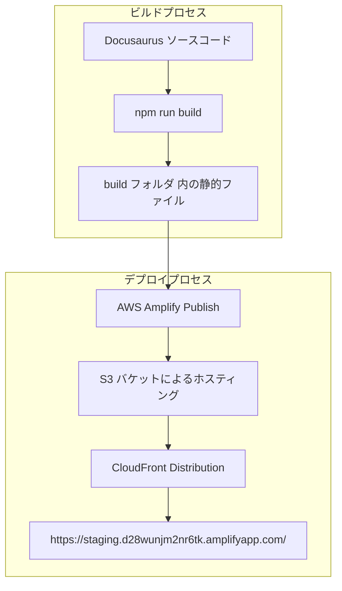

# Project: my-website-secure

```plaintext
OS: posix
Directory: /home/maki/prj/docusaurus/my-website-secure

├── scripts/
│   └── deploy.sh
├── src/
│   ├── components/
│   │   └── HomepageFeatures/
│   │       ├── index.tsx
│   │       └── styles.module.css
│   ├── css/
│   │   └── custom.css
│   └── pages/
│       ├── about/
│       │   ├── index.tsx
│       │   └── styles.module.css
│       └── markdown-page.md
├── static/
│   ├── img/
│   │   ├── favicon.ico
│   └── .nojekyll
├── .SourceSageignore
├── amplify.yml
├── amplify_outputs.json
├── build.zip
├── docusaurus.config.ts
├── package.json
├── README.md
├── sidebars.ts
└── tsconfig.json
```

## 📂 Gitリポジトリ情報

### 🌐 基本情報

- 🔗 リモートURL: https://github.com/Sunwood-ai-labs/Amplify-Docusaurus-Starter-Gen2-Custom.git
- 🌿 デフォルトブランチ: main
- 🎯 現在のブランチ: main
- 📅 作成日時: 2025-02-05 14:52:01
- 📈 総コミット数: 11

### 🔄 最新のコミット

- 📝 メッセージ: 🎨 style: ヘッダー画像の更新
- 🔍 ハッシュ: 0900a3f3
- 👤 作者: Maki (sunwood.ai.labs@gmail.com)
- ⏰ 日時: 2025-02-06 00:03:25

### 👥 主要コントリビューター

| 👤 名前 | 📊 コミット数 |
|---------|-------------|
| Maki | 11 |

## 📊 プロジェクト統計

- 📅 作成日時: 2025-02-06 00:15:13
- 📁 総ディレクトリ数: 9
- 📄 総ファイル数: 18
- 📏 最大深度: 3
- 📦 最大ディレクトリ:  (27 エントリ)

### 📊 ファイルサイズと行数

| ファイル | サイズ | 行数 | 言語 |
|----------|--------|------|------|
| build.zip | 1.5 MB | 0 | plaintext |
| README.md | 6.6 KB | 188 | markdown |
| docusaurus.config.ts | 4.4 KB | 158 | typescript |
| static/img/favicon.ico | 3.5 KB | 0 | plaintext |
| src/css/custom.css | 2.1 KB | 79 | css |
| src/pages/about/index.tsx | 1.9 KB | 58 | plaintext |
| src/components/HomepageFeatures/index.tsx | 1.9 KB | 73 | plaintext |
| package.json | 1.4 KB | 55 | json |
| scripts/deploy.sh | 1.4 KB | 40 | bash |
| node_modules/fastq/.github/workflows/ci.yml | 1.4 KB | 75 | yaml |
| node_modules/fast-uri/.github/workflows/ci.yml | 1.3 KB | 58 | yaml |
| amplify_outputs.json | 1.1 KB | 47 | json |
| node_modules/@ungap/structured-clone/.github/workflows/node.js.yml | 872.0 B | 31 | yaml |
| sidebars.ts | 860.0 B | 33 | typescript |
| src/pages/about/styles.module.css | 763.0 B | 53 | css |
| node_modules/json-schema-traverse/.github/workflows/publish.yml | 678.0 B | 27 | yaml |
| node_modules/aws-cdk-lib/node_modules/json-schema-traverse/.github/workflows/publish.yml | 678.0 B | 27 | yaml |
| .SourceSageignore | 655.0 B | 56 | plaintext |
| node_modules/json-schema-traverse/.github/workflows/build.yml | 582.0 B | 28 | yaml |
| node_modules/aws-cdk-lib/node_modules/json-schema-traverse/.github/workflows/build.yml | 582.0 B | 28 | yaml |
| node_modules/busboy/.github/workflows/ci.yml | 518.0 B | 24 | yaml |
| node_modules/streamsearch/.github/workflows/ci.yml | 509.0 B | 24 | yaml |
| node_modules/pretty-error/.github/workflows/main.yml | 481.0 B | 25 | yaml |
| node_modules/busboy/.github/workflows/lint.yml | 471.0 B | 23 | yaml |
| node_modules/streamsearch/.github/workflows/lint.yml | 471.0 B | 23 | yaml |
| node_modules/wildcard/.github/workflows/build.yml | 459.0 B | 24 | yaml |
| amplify.yml | 446.0 B | 24 | yaml |
| node_modules/aws-cdk-lib/node_modules/fast-uri/.github/workflows/ci.yml | 371.0 B | 23 | yaml |
| node_modules/aws-cdk-lib/node_modules/fast-uri/.github/workflows/package-manager-ci.yml | 319.0 B | 20 | yaml |
| node_modules/fast-uri/.github/workflows/package-manager-ci.yml | 315.0 B | 20 | yaml |
| tsconfig.json | 215.0 B | 8 | json |
| src/components/HomepageFeatures/styles.module.css | 138.0 B | 11 | css |
| src/pages/markdown-page.md | 118.0 B | 7 | markdown |
| static/.nojekyll | 0.0 B | 0 | plaintext |
| **合計** |  | **1370** |  |

### 📈 言語別統計

| 言語 | ファイル数 | 総行数 | 合計サイズ |
|------|------------|--------|------------|
| yaml | 17 | 504 | 10.2 KB |
| markdown | 2 | 195 | 6.8 KB |
| typescript | 2 | 191 | 5.3 KB |
| plaintext | 6 | 187 | 1.5 MB |
| css | 3 | 143 | 3.0 KB |
| json | 3 | 110 | 2.7 KB |
| bash | 1 | 40 | 1.4 KB |

`.SourceSageignore`

**サイズ**: 655.0 B | **行数**: 56 行
```plaintext
# バージョン管理システム関連
.git/
.gitignore

# キャッシュファイル
__pycache__/
.pytest_cache/
**/__pycache__/**
*.pyc

# ビルド・配布関連
build/
dist/
*.egg-info/

# 一時ファイル・出力
output/
output.md
test_output/
.SourceSageAssets/
.SourceSageAssetsDemo/

# アセット
*.png
*.svg
*.jpg
*.jepg
assets/

# その他
LICENSE
example/
package-lock.json
.DS_Store

# 特定のディレクトリを除外
tests/temp/
docs/drafts/

# パターンの例外（除外対象から除外）
!docs/important.md
!.github/workflows/
repository_summary.md

venv
.venv

.docusaurus

node_modules

.amplify/
amplify

docs
blog
```

`README.md`

**サイズ**: 6.6 KB | **行数**: 188 行
```markdown
<div align="center">


# 🚀 Amplify-Docusaurus-Starter


[](https://aws.amazon.com/amplify/)
[](https://docusaurus.io/)

🔥🚀 このスターターキットは、最新のAWS Amplify Gen2とDocusaurusを組み合わせ、効率的な開発とデプロイを実現します！

</div>


## 💡 概要
本リポジトリは、AWS Amplify Gen2とDocusaurusを組み合わせた静的サイトのスターターキットです。
AWS Amplify Gen2は、従来のAmplifyフレームワークを進化させ、より高速で柔軟なインフラストラクチャ管理を実現します。

### 🌟 AWS Amplify Gen2の特徴

- **TypeScriptネイティブ**: インフラストラクチャをTypeScriptで定義
- **高速なデプロイ**: 最適化されたデプロイプロセス
- **柔軟なカスタマイズ**: AWS CDKとの完全な互換性
- **改善されたローカル開発**: 強化されたサンドボックス環境
- **セキュリティ強化**: よりきめ細かいIAM権限管理

## 📥 インストール

```bash
npm install
```

## 💻 ローカル開発

```bash
npm run start
```

このコマンドは、ローカル開発サーバーを起動し、ブラウザウィンドウを開きます。変更はリアルタイムに反映されます。

## 🔨 ビルド

```bash
npm run build
```

このコマンドで、静的コンテンツが `build` ディレクトリに生成されます。

## 🛡️ セキュリティ設定

このプロジェクトは、AWS Amplifyのデフォルトのセキュリティ設定を使用しています。

## 🚀 デプロイ

### 🌐 デプロイ先URL

本サイトは以下のURLでホストされています：
https://staging.d28wunjm2nr6tk.amplifyapp.com/

### 📦 デプロイスクリプトを使用したデプロイ

このプロジェクトには、デプロイを自動化するスクリプトが用意されています：

```bash
# デプロイスクリプトを実行
./scripts/deploy.sh
```

このスクリプトは以下の処理を自動的に行います：
1. プロジェクトのビルド
2. ビルドファイルのZIP化
3. S3バケットの作成（存在しない場合）
4. ビルドファイルのS3へのアップロード

スクリプト実行後は、表示される手順に従ってAWS Amplifyコンソールでデプロイを完了させてください。

### 🛠️ 手動デプロイ

手動でデプロイを行う場合は、以下の手順に従ってください：

### 📦 AWS Amplify Gen2を使用したデプロイ

#### 1. ローカル開発環境の確認
```bash
# Amplifyの設定を確認
npx ampx info

# サンドボックスモードでテスト
npx ampx sandbox
```

#### 2. ビルドとパッケージング
```bash
# プロジェクトのビルド
npm run build

# ビルドファイルのZIP化
cd build && zip -r ../build.zip .
cd ..
```

#### 3. S3バケットの作成とアップロード
```bash
# S3バケットの作成
aws s3api create-bucket \
  --bucket my-website-secure-deploy \
  --create-bucket-configuration LocationConstraint=ap-northeast-1

# ビルドファイルのアップロード
aws s3 cp build.zip s3://my-website-secure-deploy/
```

#### 4. AWS Amplifyでのデプロイ

1. [AWS Amplifyコンソール](https://ap-northeast-1.console.aws.amazon.com/amplify/home)にアクセス
2. プロジェクト「my-website-secure」を選択
3. 「ホスティング」タブを選択
4. 「main」ブランチを選択
5. 「デプロイ」ボタンをクリック
6. 「ソースファイル」で「Amazon S3」を選択
7. S3のURL `s3://my-website-secure-deploy/build.zip` を入力
8. 「保存してデプロイ」をクリック

#### 5. クリーンアップ（オプション）
```bash
# S3のファイルを削除
aws s3 rm s3://my-website-secure-deploy/build.zip
```

### 📝 注意事項

- デプロイ前に必ず `npx ampx sandbox` でローカルテストを実行してください
- AWS認証情報が正しく設定されていることを確認してください
- S3バケット名は一意である必要があります
- デプロイ後、[Amplifyコンソール](https://ap-northeast-1.console.aws.amazon.com/amplify/home)でステータスを確認できます

## 🏗️ アーキテクチャ



※ 本サイトは、AWS Amplify による自動デプロイと CloudFront を用いた静的ファイル配信で運用されています。

## ❌ AWS Amplify の削除方法

AWS Amplify のリソースを削除する方法は以下の 2 つがあります。

### 1. AWS Amplify CLI を使った削除

プロジェクトのルートディレクトリで以下のコマンドを実行してください。

```
amplify delete
```

このコマンドは、プロジェクトに関連する全てのバックエンドリソースと Amplify App 自体を削除します。コマンド実行後、削除対象リソースの確認や最終確認のプロンプトが表示されるので、慎重に内容を確認してください。

### 2. AWS Amplify コンソールからの削除

1. AWS マネジメントコンソールにログインし、【Amplify コンソール】を開きます。
2. 削除したい Amplify App を選択します。
3. 設定メニューまたは画面右上のオプションから「App の削除」または「削除」を選択します。
4. 表示される確認プロンプトに従い、削除処理を進めます。

**注意:** 
- 一度削除するとリソースは復元できません。削除前に必要なバックアップがあるかどうかを十分に確認してください。
- WAFの設定を削除する場合は、CloudFormationスタックも個別に削除する必要があります。
```

`amplify.yml`

**サイズ**: 446.0 B | **行数**: 24 行
```yaml
version: 1
backend:
  phases:
    build:
      commands:
        - npm ci --cache .npm --prefer-offline
        - npx ampx pipeline-deploy --branch $AWS_BRANCH --app-id $AWS_APP_ID
frontend:
  phases:
    preBuild:
      commands:
        - npm ci
    build:
      commands:
        - npm run build
  artifacts:
    baseDirectory: build
    files:
      - '**/*'
  cache:
    paths:
      - build/**/*
      - .npm/**/*
      - node_modules/**/*
```

`amplify_outputs.json`

**サイズ**: 1.1 KB | **行数**: 47 行
```json
{
  "auth": {
    "user_pool_id": "ap-northeast-1_35PqH50rq",
    "aws_region": "ap-northeast-1",
    "user_pool_client_id": "5bvouf5g7fcq9gfu3o6q7h8ibt",
    "identity_pool_id": "ap-northeast-1:9200723f-07a0-465a-9df1-ebe4957c2ab2",
    "mfa_methods": [],
    "standard_required_attributes": [
      "email"
    ],
    "username_attributes": [
      "email"
    ],
    "user_verification_types": [
      "email"
    ],
    "groups": [],
    "mfa_configuration": "NONE",
    "password_policy": {
      "min_length": 8,
      "require_lowercase": true,
      "require_numbers": true,
      "require_symbols": true,
      "require_uppercase": true
    },
    "oauth": {
      "identity_providers": [],
      "redirect_sign_in_uri": [
        "http://localhost:3000"
      ],
      "redirect_sign_out_uri": [
        "http://localhost:3000"
      ],
      "response_type": "code",
      "scopes": [
        "phone",
        "email",
        "openid",
        "profile",
        "aws.cognito.signin.user.admin"
      ],
      "domain": "9125678326ef65c62026.auth.ap-northeast-1.amazoncognito.com"
    },
    "unauthenticated_identities_enabled": true
  },
  "version": "1.3"
}
```

`build.zip` - Binary file

`docusaurus.config.ts`

**サイズ**: 4.4 KB | **行数**: 158 行
```typescript
import {themes as prismThemes} from 'prism-react-renderer';
import type {Config} from '@docusaurus/types';
import type * as Preset from '@docusaurus/preset-classic';

// This runs in Node.js - Don't use client-side code here (browser APIs, JSX...)

const config: Config = {
  title: 'My Site',
  tagline: 'Dinosaurs are cool',
  favicon: 'img/cat1.svg',

  // Set the production url of your site here
  url: 'https://staging.d28wunjm2nr6tk.amplifyapp.com',
  // Set the /<baseUrl>/ pathname under which your site is served
  baseUrl: '/',
  trailingSlash: true,

  // GitHub pages deployment config.
  // If you aren't using GitHub pages, you don't need these.
  organizationName: 'Sunwood-ai-labs', // Usually your GitHub org/user name.
  projectName: 'Amplify-Docusaurus-Starter', // Usually your repo name.

  onBrokenLinks: 'warn',
  onBrokenMarkdownLinks: 'warn',

  // Even if you don't use internationalization, you can use this field to set
  // useful metadata like html lang. For example, if your site is Chinese, you
  // may want to replace "en" with "zh-Hans".
  i18n: {
    defaultLocale: 'en',
    locales: ['en'],
  },

  presets: [
    [
      'classic',
      {
        docs: {
          sidebarPath: './sidebars.ts',
          // Please change this to your repo.
          // Remove this to remove the "edit this page" links.
          editUrl:
            'https://github.com/Sunwood-ai-labs/Amplify-Docusaurus-Starter/tree/main/packages/create-docusaurus/templates/shared/',
        },
        blog: {
          showReadingTime: true,
          // ブログのルートパスを/blogに設定
          routeBasePath: 'blog',
          // サイドバーに表示する記事数を増やす
          blogSidebarCount: 'ALL',
          blogSidebarTitle: '全ての記事',
          // 未切り詰めのブログ投稿の警告を無視
          onUntruncatedBlogPosts: 'ignore',
          feedOptions: {
            type: ['rss', 'atom'],
            xslt: true,
          },
          // Please change this to your repo.
          // Remove this to remove the "edit this page" links.
          editUrl:
            'https://github.com/Sunwood-ai-labs/Amplify-Docusaurus-Starter/tree/main/packages/create-docusaurus/templates/shared/',
          // Useful options to enforce blogging best practices
          onInlineTags: 'warn',
          onInlineAuthors: 'warn',
        },
        theme: {
          customCss: './src/css/custom.css',
        },
      } satisfies Preset.Options,
    ],
  ],

  themeConfig: {
    // Replace with your project's social card
    image: 'img/cat1.svg',
    navbar: {
      title: 'My Site',
      logo: {
        alt: 'My Site Logo',
        src: 'img/cat1.svg',
      },
      items: [
        {
          type: 'docSidebar',
          sidebarId: 'tutorialSidebar',
          position: 'left',
          label: 'Tutorial',
        },
        {
          to: '/about',
          label: 'About Us',
          position: 'left',
        },
        {
          to: '/blog/tags',
          label: 'Tags',
          position: 'left',
        },
        {
          href: 'https://github.com/Sunwood-ai-labs/Amplify-Docusaurus-Starter',
          label: 'GitHub',
          position: 'right',
        },
      ],
    },
    footer: {
      style: 'dark',
      links: [
        {
          title: 'Docs',
          items: [
            {
              label: 'Tutorial',
              to: '/docs/intro',
            },
          ],
        },
        {
          title: 'Community',
          items: [
            {
              label: 'Stack Overflow',
              href: 'https://stackoverflow.com/questions/tagged/docusaurus',
            },
            {
              label: 'Discord',
              href: 'https://discordapp.com/invite/docusaurus',
            },
            {
              label: 'X',
              href: 'https://x.com/docusaurus',
            },
          ],
        },
        {
          title: 'More',
          items: [
            {
              label: 'Blog',
              to: '/blog',
            },
            {
              label: 'GitHub',
              href: 'https://github.com/Sunwood-ai-labs/Amplify-Docusaurus-Starter',
            },
          ],
        },
      ],
      copyright: `Copyright ${new Date().getFullYear()} My Project, Inc. Built with Docusaurus.`,
    },
    prism: {
      theme: prismThemes.github,
      darkTheme: prismThemes.dracula,
    },
  } satisfies Preset.ThemeConfig,
};

export default config;
```

`package.json`

**サイズ**: 1.4 KB | **行数**: 55 行
```json
{
  "name": "my-website",
  "version": "0.0.0",
  "private": true,
  "scripts": {
    "docusaurus": "docusaurus",
    "start": "docusaurus start",
    "build": "docusaurus build",
    "swizzle": "docusaurus swizzle",
    "deploy": "GIT_USER=Sunwood-ai-labs docusaurus deploy",
    "clear": "docusaurus clear",
    "serve": "docusaurus serve",
    "write-translations": "docusaurus write-translations",
    "write-heading-ids": "docusaurus write-heading-ids",
    "typecheck": "tsc"
  },
  "dependencies": {
    "@docusaurus/core": "3.7.0",
    "@docusaurus/preset-classic": "3.7.0",
    "@mdx-js/react": "^3.0.0",
    "aws-amplify": "^6.12.3",
    "clsx": "^2.0.0",
    "prism-react-renderer": "^2.3.0",
    "react": "^19.0.0",
    "react-dom": "^19.0.0"
  },
  "devDependencies": {
    "@aws-amplify/backend": "^1.14.0",
    "@aws-amplify/backend-cli": "^1.4.9",
    "@docusaurus/module-type-aliases": "3.7.0",
    "@docusaurus/tsconfig": "3.7.0",
    "@docusaurus/types": "3.7.0",
    "aws-cdk": "^2.177.0",
    "aws-cdk-lib": "^2.177.0",
    "constructs": "^10.4.2",
    "esbuild": "^0.24.2",
    "tsx": "^4.19.2",
    "typescript": "^5.7.3"
  },
  "browserslist": {
    "production": [
      ">0.5%",
      "not dead",
      "not op_mini all"
    ],
    "development": [
      "last 3 chrome version",
      "last 3 firefox version",
      "last 5 safari version"
    ]
  },
  "engines": {
    "node": ">=18.0"
  }
}
```

`sidebars.ts`

**サイズ**: 860.0 B | **行数**: 33 行
```typescript
import type {SidebarsConfig} from '@docusaurus/plugin-content-docs';

// This runs in Node.js - Don't use client-side code here (browser APIs, JSX...)

/**
 * Creating a sidebar enables you to:
 - create an ordered group of docs
 - render a sidebar for each doc of that group
 - provide next/previous navigation

 The sidebars can be generated from the filesystem, or explicitly defined here.

 Create as many sidebars as you want.
 */
const sidebars: SidebarsConfig = {
  // By default, Docusaurus generates a sidebar from the docs folder structure
  tutorialSidebar: [{type: 'autogenerated', dirName: '.'}],

  // But you can create a sidebar manually
  /*
  tutorialSidebar: [
    'intro',
    'hello',
    {
      type: 'category',
      label: 'Tutorial',
      items: ['tutorial-basics/create-a-document'],
    },
  ],
   */
};

export default sidebars;
```

`tsconfig.json`

**サイズ**: 215.0 B | **行数**: 8 行
```json
{
  // This file is not used in compilation. It is here just for a nice editor experience.
  "extends": "@docusaurus/tsconfig",
  "compilerOptions": {
    "baseUrl": "."
  },
  "exclude": [".docusaurus", "build"]
}
```

`static/.nojekyll`

**サイズ**: 0.0 B | **行数**: 0 行
```plaintext
(Empty file)
```

`static/img/favicon.ico` - Binary file

`scripts/deploy.sh`

**サイズ**: 1.4 KB | **行数**: 40 行
```bash
#!/bin/bash

# エラーが発生したら即座に終了
set -e

# 環境変数の設定
BUCKET_NAME="my-website-secure-deploy"
REGION="ap-northeast-1"

echo "🚀 デプロイを開始します..."

# ビルド
echo "📦 プロジェクトをビルドしています..."
npm run build

# buildディレクトリに移動してZIP化
echo "🗜️ ビルドファイルをZIP化しています..."
cd build && zip -r ../build.zip . && cd ..

# S3バケットの存在確認
if ! aws s3 ls "s3://$BUCKET_NAME" 2>&1 > /dev/null; then
  echo "🪣 S3バケットを作成しています..."
  aws s3api create-bucket \
    --bucket $BUCKET_NAME \
    --create-bucket-configuration LocationConstraint=$REGION
fi

# ビルドファイルのアップロード
echo "📤 S3にファイルをアップロードしています..."
aws s3 cp build.zip "s3://$BUCKET_NAME/"

echo "✨ デプロイが完了しました！"
echo "🌐 AWS Amplifyコンソールで残りの手順を実行してください："
echo "1. https://ap-northeast-1.console.aws.amazon.com/amplify/home にアクセス"
echo "2. プロジェクト「my-website-secure」を選択"
echo "3. 「ホスティング」タブを選択"
echo "4. 「main」ブランチを選択"
echo "5. 「デプロイ」ボタンをクリック"
echo "6. S3のURL: s3://$BUCKET_NAME/build.zip を入力"
echo "7. 「保存してデプロイ」をクリック"
```

`src/components/HomepageFeatures/index.tsx`

**サイズ**: 1.9 KB | **行数**: 73 行
```plaintext
import clsx from 'clsx';
import Heading from '@theme/Heading';
import styles from './styles.module.css';

type FeatureItem = {
  title: string;
  image: string;
  description: JSX.Element;
};

const FeatureList: FeatureItem[] = [
  {
    title: '最先端のAI研究',
    image: 'img/cat2.svg',
    description: (
      <>
        自然言語処理、コンピュータビジョン、強化学習など、
        最先端のAI技術の研究開発に取り組んでいます。
        産学連携を通じて、革新的なソリューションを生み出します。
      </>
    ),
  },
  {
    title: 'オープンイノベーション',
    image: 'img/cat3.svg',
    description: (
      <>
        私たちは研究成果をオープンソースとして公開し、
        グローバルなAIコミュニティと協力して
        技術革新を推進します。
      </>
    ),
  },
  {
    title: '実世界への応用',
    image: 'img/cat4.svg',
    description: (
      <>
        研究成果を実世界の課題解決に応用し、
        社会に貢献するAIソリューションの
        実装を目指しています。
      </>
    ),
  },
];

function Feature({title, image, description}: FeatureItem) {
  return (
    <div className={clsx('col col--4')}>
      <div className="text--center">
        
      </div>
      <div className="text--center padding-horiz--md">
        <Heading as="h3">{title}</Heading>
        <p>{description}</p>
      </div>
    </div>
  );
}

export default function HomepageFeatures(): JSX.Element {
  return (
    <section className={styles.features}>
      <div className="container">
        <div className="row">
          {FeatureList.map((props, idx) => (
            <Feature key={idx} {...props} />
          ))}
        </div>
      </div>
    </section>
  );
}
```

`src/components/HomepageFeatures/styles.module.css`

**サイズ**: 138.0 B | **行数**: 11 行
```css
.features {
  display: flex;
  align-items: center;
  padding: 2rem 0;
  width: 100%;
}

.featureSvg {
  height: 200px;
  width: 200px;
}
```

`src/pages/markdown-page.md`

**サイズ**: 118.0 B | **行数**: 7 行
```markdown
---
title: Markdown page example
---

# Markdown page example

You don't need React to write simple standalone pages.
```

`src/pages/about/index.tsx`

**サイズ**: 1.9 KB | **行数**: 58 行
```plaintext
import React from 'react';
import clsx from 'clsx';
import Layout from '@theme/Layout';
import useDocusaurusContext from '@docusaurus/useDocusaurusContext';
import styles from './styles.module.css';

function AboutHeader() {
  const {siteConfig} = useDocusaurusContext();
  return (
    <header className={clsx('hero hero--primary', styles.heroBanner)}>
      <div className="container">
        <h1 className="hero__title">About Us</h1>
        <p className="hero__subtitle">Sunwood AI Labsについて</p>
      </div>
    </header>
  );
}

export default function About(): JSX.Element {
  const {siteConfig} = useDocusaurusContext();
  return (
    <Layout
      title={`About Us`}
      description="Sunwood AI Labsの会社概要">
      <AboutHeader />
      <main>
        <div className={styles.aboutSection}>
          <div className="container">
            <div className="row">
              <div className="col col--6">
                <div className={styles.aboutContent}>
                  <h2>Our Mission</h2>
                  <p>
                    Sunwood AI Labsは、最先端のAI技術とクラウドソリューションを通じて、
                    ビジネスの課題解決と技術革新を支援します。
                  </p>
                  <h2>Our Vision</h2>
                  <p>
                    私たちは、AIとクラウドテクノロジーの力で、より良い未来を創造することを目指しています。
                  </p>
                </div>
              </div>
              <div className="col col--6">
                <div className={styles.aboutImageContainer}>
                  
                </div>
              </div>
            </div>
          </div>
        </div>
      </main>
    </Layout>
  );
}
```

`src/pages/about/styles.module.css`

**サイズ**: 763.0 B | **行数**: 53 行
```css
.heroBanner {
  padding: 4rem 0;
  text-align: center;
  position: relative;
  overflow: hidden;
}

@media screen and (max-width: 996px) {
  .heroBanner {
    padding: 2rem;
  }
}

.buttons {
  display: flex;
  align-items: center;
  justify-content: center;
  gap: 1rem;
  margin-top: 2rem;
}

.aboutSection {
  padding: 4rem 0;
}

.aboutContent {
  padding: 2rem;
}

.aboutContent h2 {
  margin-bottom: 1.5rem;
  color: var(--ifm-color-primary);
}

.aboutContent p {
  font-size: 1.1rem;
  line-height: 1.7;
  margin-bottom: 2rem;
}

.aboutImageContainer {
  display: flex;
  justify-content: center;
  align-items: center;
  padding: 2rem;
}

.aboutImage {
  max-width: 100%;
  height: auto;
  border-radius: 8px;
  box-shadow: 0 4px 8px rgba(0, 0, 0, 0.1);
}
```

`src/css/custom.css`

**サイズ**: 2.1 KB | **行数**: 79 行
```css
/**
 * Any CSS included here will be global. The classic template
 * bundles Infima by default. Infima is a CSS framework designed to
 * work well for content-centric websites.
 */

/* You can override the default Infima variables here. */
:root {
  --ifm-color-primary: #e65100;
  --ifm-color-primary-dark: #cf4900;
  --ifm-color-primary-darker: #c34400;
  --ifm-color-primary-darkest: #a13800;
  --ifm-color-primary-light: #fd5900;
  --ifm-color-primary-lighter: #ff6010;
  --ifm-color-primary-lightest: #ff7733;
  --ifm-code-font-size: 95%;
  --docusaurus-highlighted-code-line-bg: rgba(0, 0, 0, 0.1);
}

/* For readability concerns, you should choose a lighter palette in dark mode. */
[data-theme='dark'] {
  --ifm-color-primary: #ff9800;
  --ifm-color-primary-dark: #e68900;
  --ifm-color-primary-darker: #d98100;
  --ifm-color-primary-darkest: #b36a00;
  --ifm-color-primary-light: #ffa21a;
  --ifm-color-primary-lighter: #ffaa2c;
  --ifm-color-primary-lightest: #ffb94d;
  --docusaurus-highlighted-code-line-bg: rgba(0, 0, 0, 0.3);
}

/* カスタムスタイル */
.hero--primary {
  background: linear-gradient(135deg, 
    var(--ifm-color-primary-darkest) 0%,
    var(--ifm-color-primary) 50%,
    var(--ifm-color-primary-lighter) 100%);
  animation: gradientAnimation 15s ease infinite;
  background-size: 200% 200%;
}

@keyframes gradientAnimation {
  0% {
    background-position: 0% 50%;
  }
  50% {
    background-position: 100% 50%;
  }
  100% {
    background-position: 0% 50%;
  }
}

.hero__title {
  font-size: 3rem;
  background: linear-gradient(to right, #ffffff, #fff5e6);
  -webkit-background-clip: text;
  -webkit-text-fill-color: transparent;
  text-shadow: 0 0 20px rgba(255, 255, 255, 0.1);
}

.hero__subtitle {
  font-size: 1.5rem;
  color: #fff5e6;
  text-shadow: 0 2px 4px rgba(0, 0, 0, 0.2);
}

.button.button--secondary {
  background-color: rgba(255, 255, 255, 0.9);
  color: var(--ifm-color-primary-darkest);
  border: none;
  transition: all 0.3s ease;
}

.button.button--secondary:hover {
  background-color: #ffffff;
  transform: translateY(-2px);
  box-shadow: 0 4px 8px rgba(0, 0, 0, 0.2);
}
```

`node_modules/fast-uri/.github/workflows/ci.yml`

**サイズ**: 1.3 KB | **行数**: 58 行
```yaml
name: CI

on:
  push:
    branches:
     - main
     - master
     - next
     - 'v*'
    paths-ignore:
      - 'docs/**'
      - '*.md'
  pull_request:
    paths-ignore:
      - 'docs/**'
      - '*.md'

jobs:
  test-regression-check-node10:
    name: Test compatibility with Node.js 10
    runs-on: ubuntu-latest
    steps:
      - uses: actions/checkout@v4
        with:
          persist-credentials: false

      - uses: actions/setup-node@v4
        with:
          node-version: '10'
          cache: 'npm'
          cache-dependency-path: package.json
          check-latest: true

      - name: Install
        run: |
          npm install --ignore-scripts

      - name: Copy project as fast-uri to node_node_modules
        run: |
          rm -rf ./node_modules/fast-uri/lib &&
          rm -rf ./node_modules/fast-uri/index.js &&
          cp -r ./lib ./node_modules/fast-uri/lib &&
          cp ./index.js ./node_modules/fast-uri/index.js

      - name: Run tests
        run: |
          npm run test:unit
        env:
          NODE_OPTIONS: no-network-family-autoselection

  test:
    needs:
      - test-regression-check-node10
    uses: fastify/workflows/.github/workflows/plugins-ci.yml@v5
    with:
      license-check: true
      lint: true
      node-versions: '["16", "18", "20", "22"]'
```

`node_modules/fast-uri/.github/workflows/package-manager-ci.yml`

**サイズ**: 315.0 B | **行数**: 20 行
```yaml
name: package-manager-ci

on:
  push:
    branches:
     - main
     - master
     - next
     - 'v*'
    paths-ignore:
      - 'docs/**'
      - '*.md'
  pull_request:
    paths-ignore:
      - 'docs/**'
      - '*.md'

jobs:
  test:
    uses: fastify/workflows/.github/workflows/plugins-ci-package-manager.yml@v5
```

`node_modules/wildcard/.github/workflows/build.yml`

**サイズ**: 459.0 B | **行数**: 24 行
```yaml
name: Build & Test

on:
  push:
    branches: [ master ]
  pull_request:
    branches: [ master ]

jobs:
  build:
    runs-on: ubuntu-latest

    strategy:
      matrix:
        node-version: [16.x, 18.x, 20.x]

    steps:
      - uses: actions/checkout@v3
      - name: Use Node.js ${{ matrix.node-version }}
        uses: actions/setup-node@v3
        with:
          node-version: ${{ matrix.node-version }}
      - run: yarn install
      - run: yarn test
```

`node_modules/@ungap/structured-clone/.github/workflows/node.js.yml`

**サイズ**: 872.0 B | **行数**: 31 行
```yaml
# This workflow will do a clean install of node dependencies, cache/restore them, build the source code and run tests across different versions of node
# For more information see: https://help.github.com/actions/language-and-framework-guides/using-nodejs-with-github-actions

name: build

on: [push, pull_request]

jobs:
  build:

    runs-on: ubuntu-latest

    strategy:
      matrix:
        node-version: [16]

    steps:
    - uses: actions/checkout@v2
    - name: Use Node.js ${{ matrix.node-version }}
      uses: actions/setup-node@v2
      with:
        node-version: ${{ matrix.node-version }}
        cache: 'npm'
    - run: npm ci
    - run: npm run build --if-present
    - run: npm test
    - run: npm run coverage --if-present
    - name: Coveralls
      uses: coverallsapp/github-action@master
      with:
        github-token: ${{ secrets.GITHUB_TOKEN }}
```

`node_modules/json-schema-traverse/.github/workflows/build.yml`

**サイズ**: 582.0 B | **行数**: 28 行
```yaml
name: build

on:
  push:
    branches: [master]
  pull_request:
    branches: ["*"]

jobs:
  build:
    runs-on: ubuntu-latest

    strategy:
      matrix:
        node-version: [10.x, 12.x, 14.x]

    steps:
      - uses: actions/checkout@v2
      - name: Use Node.js ${{ matrix.node-version }}
        uses: actions/setup-node@v1
        with:
          node-version: ${{ matrix.node-version }}
      - run: npm install
      - run: npm test
      - name: Coveralls
        uses: coverallsapp/github-action@master
        with:
          github-token: ${{ secrets.GITHUB_TOKEN }}
```

`node_modules/json-schema-traverse/.github/workflows/publish.yml`

**サイズ**: 678.0 B | **行数**: 27 行
```yaml
name: publish

on:
  release:
    types: [published]

jobs:
  publish-npm:
    runs-on: ubuntu-latest
    steps:
      - uses: actions/checkout@v2
      - uses: actions/setup-node@v1
        with:
          node-version: 14
          registry-url: https://registry.npmjs.org/
      - run: npm install
      - run: npm test
      - name: Publish beta version to npm
        if: "github.event.release.prerelease"
        run: npm publish --tag beta
        env:
          NODE_AUTH_TOKEN: ${{ secrets.NPM_TOKEN }}
      - name: Publish to npm
        if: "!github.event.release.prerelease"
        run: npm publish
        env:
          NODE_AUTH_TOKEN: ${{ secrets.NPM_TOKEN }}
```

`node_modules/fastq/.github/workflows/ci.yml`

**サイズ**: 1.4 KB | **行数**: 75 行
```yaml
name: ci

on: [push, pull_request]

jobs:
  legacy:
    runs-on: ubuntu-latest

    strategy:
      matrix:
        node-version: ['0.10', '0.12', 4.x, 6.x, 8.x]

    steps:
      - uses: actions/checkout@v3
        with:
          persist-credentials: false

      - name: Use Node.js
        uses: actions/setup-node@v1
        with:
          node-version: ${{ matrix.node-version }}

      - name: Install
        run: |
          npm install --production && npm install tape

      - name: Run tests
        run: |
          npm run legacy

  test:
    runs-on: ubuntu-latest

    strategy:
      matrix:
        node-version: [10.x, 12.x, 13.x, 14.x, 15.x, 16.x, 18.x, 20.x]

    steps:
      - uses: actions/checkout@v3
        with:
          persist-credentials: false

      - name: Use Node.js
        uses: actions/setup-node@v3
        with:
          node-version: ${{ matrix.node-version }}

      - name: Install
        run: |
          npm install

      - name: Run tests
        run: |
          npm run test

  types:
    runs-on: ubuntu-latest

    steps:
      - uses: actions/checkout@v3
        with:
          persist-credentials: false

      - name: Use Node.js
        uses: actions/setup-node@v3
        with:
          node-version: 16

      - name: Install
        run: |
          npm install

      - name: Run types tests
        run: |
          npm run typescript
```

`node_modules/busboy/.github/workflows/ci.yml`

**サイズ**: 518.0 B | **行数**: 24 行
```yaml
name: CI

on:
  pull_request:
  push:
    branches: [ master ]

jobs:
  tests-linux:
    runs-on: ubuntu-latest
    strategy:
      fail-fast: false
      matrix:
        node-version: [10.16.0, 10.x, 12.x, 14.x, 16.x]
    steps:
      - uses: actions/checkout@v2
      - name: Use Node.js ${{ matrix.node-version }}
        uses: actions/setup-node@v1
        with:
          node-version: ${{ matrix.node-version }}
      - name: Install module
        run: npm install
      - name: Run tests
        run: npm test
```

`node_modules/busboy/.github/workflows/lint.yml`

**サイズ**: 471.0 B | **行数**: 23 行
```yaml
name: lint

on:
  pull_request:
  push:
    branches: [ master ]

env:
  NODE_VERSION: 16.x

jobs:
  lint-js:
    runs-on: ubuntu-latest
    steps:
      - uses: actions/checkout@v2
      - name: Use Node.js ${{ env.NODE_VERSION }}
        uses: actions/setup-node@v1
        with:
          node-version: ${{ env.NODE_VERSION }}
      - name: Install ESLint + ESLint configs/plugins
        run: npm install --only=dev
      - name: Lint files
        run: npm run lint
```

`node_modules/aws-cdk-lib/node_modules/fast-uri/.github/workflows/ci.yml`

**サイズ**: 371.0 B | **行数**: 23 行
```yaml
name: CI

on:
  push:
    branches:
     - main
     - master
     - next
     - 'v*'
    paths-ignore:
      - 'docs/**'
      - '*.md'
  pull_request:
    paths-ignore:
      - 'docs/**'
      - '*.md'

jobs:
  test:
    uses: fastify/workflows/.github/workflows/plugins-ci.yml@v5.0.0
    with:
      license-check: true
      node-versions: '["16", "18", "20", "22"]'
```

`node_modules/aws-cdk-lib/node_modules/fast-uri/.github/workflows/package-manager-ci.yml`

**サイズ**: 319.0 B | **行数**: 20 行
```yaml
name: package-manager-ci

on:
  push:
    branches:
     - main
     - master
     - next
     - 'v*'
    paths-ignore:
      - 'docs/**'
      - '*.md'
  pull_request:
    paths-ignore:
      - 'docs/**'
      - '*.md'

jobs:
  test:
    uses: fastify/workflows/.github/workflows/plugins-ci-package-manager.yml@v5.0.0
```

`node_modules/aws-cdk-lib/node_modules/json-schema-traverse/.github/workflows/build.yml`

**サイズ**: 582.0 B | **行数**: 28 行
```yaml
name: build

on:
  push:
    branches: [master]
  pull_request:
    branches: ["*"]

jobs:
  build:
    runs-on: ubuntu-latest

    strategy:
      matrix:
        node-version: [10.x, 12.x, 14.x]

    steps:
      - uses: actions/checkout@v2
      - name: Use Node.js ${{ matrix.node-version }}
        uses: actions/setup-node@v1
        with:
          node-version: ${{ matrix.node-version }}
      - run: npm install
      - run: npm test
      - name: Coveralls
        uses: coverallsapp/github-action@master
        with:
          github-token: ${{ secrets.GITHUB_TOKEN }}
```

`node_modules/aws-cdk-lib/node_modules/json-schema-traverse/.github/workflows/publish.yml`

**サイズ**: 678.0 B | **行数**: 27 行
```yaml
name: publish

on:
  release:
    types: [published]

jobs:
  publish-npm:
    runs-on: ubuntu-latest
    steps:
      - uses: actions/checkout@v2
      - uses: actions/setup-node@v1
        with:
          node-version: 14
          registry-url: https://registry.npmjs.org/
      - run: npm install
      - run: npm test
      - name: Publish beta version to npm
        if: "github.event.release.prerelease"
        run: npm publish --tag beta
        env:
          NODE_AUTH_TOKEN: ${{ secrets.NPM_TOKEN }}
      - name: Publish to npm
        if: "!github.event.release.prerelease"
        run: npm publish
        env:
          NODE_AUTH_TOKEN: ${{ secrets.NPM_TOKEN }}
```

`node_modules/streamsearch/.github/workflows/ci.yml`

**サイズ**: 509.0 B | **行数**: 24 行
```yaml
name: CI

on:
  pull_request:
  push:
    branches: [ master ]

jobs:
  tests-linux:
    runs-on: ubuntu-latest
    strategy:
      fail-fast: false
      matrix:
        node-version: [10.x, 12.x, 14.x, 16.x]
    steps:
      - uses: actions/checkout@v2
      - name: Use Node.js ${{ matrix.node-version }}
        uses: actions/setup-node@v1
        with:
          node-version: ${{ matrix.node-version }}
      - name: Install module
        run: npm install
      - name: Run tests
        run: npm test
```

`node_modules/streamsearch/.github/workflows/lint.yml`

**サイズ**: 471.0 B | **行数**: 23 行
```yaml
name: lint

on:
  pull_request:
  push:
    branches: [ master ]

env:
  NODE_VERSION: 16.x

jobs:
  lint-js:
    runs-on: ubuntu-latest
    steps:
      - uses: actions/checkout@v2
      - name: Use Node.js ${{ env.NODE_VERSION }}
        uses: actions/setup-node@v1
        with:
          node-version: ${{ env.NODE_VERSION }}
      - name: Install ESLint + ESLint configs/plugins
        run: npm install --only=dev
      - name: Lint files
        run: npm run lint
```

`node_modules/pretty-error/.github/workflows/main.yml`

**サイズ**: 481.0 B | **行数**: 25 行
```yaml
name: Node.js CI

on:
  push:
    branches: [master]
  pull_request:
    branches: [master]

jobs:
  build:
    runs-on: ubuntu-latest

    strategy:
      matrix:
        node-version: [12.x, 14.x, 15.x]

    steps:
      - uses: actions/checkout@v2
      - name: Use Node.js ${{ matrix.node-version }}
        uses: actions/setup-node@v1
        with:
          node-version: ${{ matrix.node-version }}
      - run: npm install
      - run: npm run compile
      - run: npm test
```

