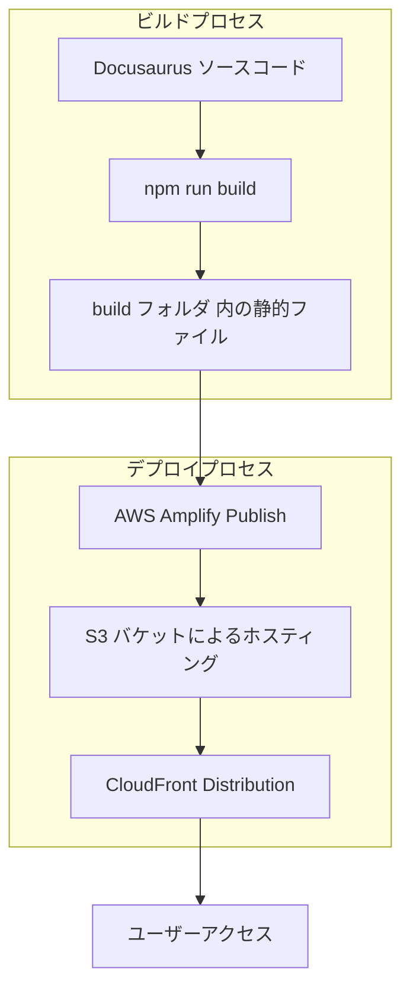

<div align="center">


# 🚀 Amplify-Docusaurus-Starter


[](https://aws.amazon.com/amplify/)
[](https://docusaurus.io/)

🔥🚀 このスターターキットは、最新のウェブ技術とAWSサービスを組み合わせ、効率的な開発とデプロイを実現します！


</div>


## 💡 概要
本リポジトリは、AWS AmplifyとDocusaurusを組み合わせた静的サイトのスターターキットです。
このテンプレートを利用することで、迅速にドキュメントサイトやウェブサイトの構築・デプロイが可能となります。

## 📥 インストール

```bash
npm install
```

## 💻 ローカル開発

```bash
npm run start
```

このコマンドは、ローカル開発サーバーを起動し、ブラウザウィンドウを開きます。変更はリアルタイムに反映されます。

## 🔨 ビルド

```bash
npm run build
```

このコマンドで、静的コンテンツが `build` ディレクトリに生成されます。

## 🚀 デプロイ

### GitHub Pages でのデプロイ

SSH を使用する場合:

```bash
USE_SSH=true npm run deploy
```

SSH を使用しない場合:

```bash
GIT_USER=Sunwood-ai-labs npm run deploy
```

このコマンドは、ウェブサイトをビルドし、`gh-pages` ブランチへ自動でプッシュします。

### ☁️ AWS Amplify を使用したデプロイ

1. **バックエンドの更新とデプロイ**
   ```bash
   amplify push
   ```
   
2. **ビルド成果物のアップロードと公開**
   ```bash
   amplify publish
   ```

3. **Amplify Console の起動**
   ```bash
   amplify console
   ```

## 🚀 gh-pages を利用したデプロイ方法

GitHub Pagesを使用してサイトを公開するには、以下の手順を実行してください。

1. 

```bash
npm run build
```
ビルドコマンドで `build` ディレクトリに静的ファイルを生成します。

2. 必要に応じて、SSHを利用する場合は以下のコマンドを実行します。

   ```bash
   USE_SSH=true npm run deploy
   ```

3. SSHを使用しない場合は、次のコマンドを実行します。

   ```bash
   GIT_USER=Sunwood-ai-labs npm run deploy
   ```

このコマンドは、`gh-pages` ブランチへサイトを自動的にデプロイします。

## 🏗️ アーキテクチャ



※ 本サイトは、AWS Amplify による自動デプロイと CloudFront を用いた静的ファイル配信で運用されています。

---

## ❌ AWS Amplify の削除方法

AWS Amplify のリソースを削除する方法は以下の 2 つがあります。

### 1. AWS Amplify CLI を使った削除

プロジェクトのルートディレクトリで以下のコマンドを実行してください。

```
amplify delete
```

このコマンドは、プロジェクトに関連する全てのバックエンドリソースと Amplify App 自体を削除します。コマンド実行後、削除対象リソースの確認や最終確認のプロンプトが表示されるので、慎重に内容を確認してください。

### 2. AWS Amplify コンソールからの削除

1. AWS マネジメントコンソールにログインし、【Amplify コンソール】を開きます。
2. 削除したい Amplify App を選択します。
3. 設定メニューまたは画面右上のオプションから「App の削除」または「削除」を選択します。
4. 表示される確認プロンプトに従い、削除処理を進めます。

**注意:** 一度削除するとリソースは復元できません。削除前に必要なバックアップがあるかどうかを十分に確認してください。
