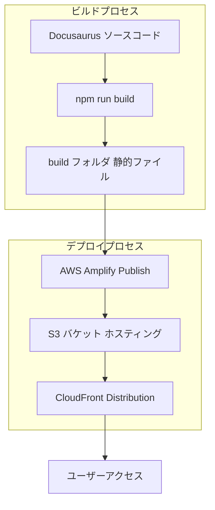

# 🚀 Amplify-Docusaurus-Starter
 
[](https://aws.amazon.com/amplify/) [](https://docusaurus.io/) 


🔥🚀 このスターターキットは、最新のウェブ技術とAWSサービスを組み合わせた、効率的な開発とデプロイを実現します！

## 💡 概要
本リポジトリは、AWS AmplifyとDocusaurusを組み合わせた静的サイトのスターターキットです。
このテンプレートを利用することで、迅速にドキュメントサイトやウェブサイトの構築・デプロイが可能となります。
以下に、インストール方法、ローカル開発、ビルド、デプロイ、及びアーキテクチャの概要を示します。

このウェブサイトは、[Docusaurus](https://docusaurus.io/) を使用して構築されています。Docusaurus は、モダンな静的ウェブサイトジェネレーターです。

### 📥 インストール

```
$ yarn
```

### 💻 ローカル開発

```
$ yarn start
```

このコマンドは、ローカル開発サーバーを起動し、ブラウザウィンドウを開きます。ほとんどの変更は、サーバーを再起動せずにリアルタイムに反映されます。

### 🔨 ビルド

```
$ yarn build
```

このコマンドは、静的コンテンツを `build` ディレクトリに生成し、任意の静的コンテンツホスティングサービスで提供できます。

### 🚀 デプロイ

SSH を使用する場合:

```
$ USE_SSH=true yarn deploy
```

SSH を使用しない場合:

```
$ GIT_USER=<Your GitHub username> yarn deploy
```

GitHub Pages を使用してホスティングする場合、このコマンドは、ウェブサイトをビルドし、`gh-pages` ブランチにプッシュする便利な方法です。

### ☁️ AWS Amplify を使用したデプロイ

Amplify CLI を利用して、以下の手順でバックエンドリソースとフロントエンドのビルド成果物をデプロイできます。

1. **バックエンドの更新とデプロイ**
   ```bash
   amplify push
   ```
   - バックエンドの設定（例：S3, CloudFront など）の変更を適用します。

2. **ビルド成果物のアップロードと公開**
   ```bash
   amplify publish
   ```
   - local の build フォルダに生成された静的ファイルを S3 バケットにアップロードし、CloudFront を通じてサイトを公開します。

3. **Amplify Console の起動**
   ```bash
   amplify console
   ```
   - ウェブブラウザで Amplify Console を開き、デプロイ状況や詳細設定を確認できます。

## 🏗️ アーキテクチャ

下記は、本サイトのデプロイ構成を示すアーキテクチャ図です。



※ 本サイトは、AWS Amplify による自動デプロイと CloudFront を用いた静的ファイル配信で運用されています。
