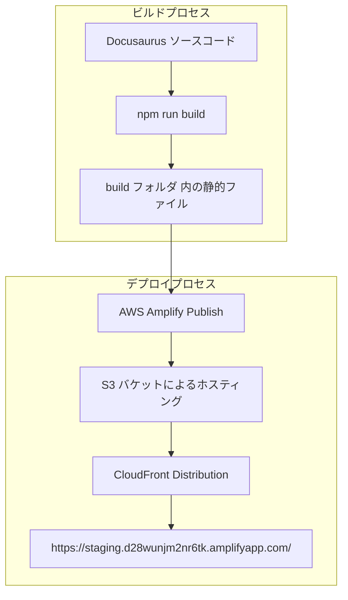

<div align="center">


# 🚀 Amplify-Docusaurus-Starter


[](https://aws.amazon.com/amplify/)
[](https://docusaurus.io/)

🔥🚀 このスターターキットは、最新のAWS Amplify Gen2とDocusaurusを組み合わせ、効率的な開発とデプロイを実現します！

</div>


## 💡 概要
本リポジトリは、AWS Amplify Gen2とDocusaurusを組み合わせた静的サイトのスターターキットです。
AWS Amplify Gen2は、従来のAmplifyフレームワークを進化させ、より高速で柔軟なインフラストラクチャ管理を実現します。

### 🌟 AWS Amplify Gen2の特徴

- **TypeScriptネイティブ**: インフラストラクチャをTypeScriptで定義
- **高速なデプロイ**: 最適化されたデプロイプロセス
- **柔軟なカスタマイズ**: AWS CDKとの完全な互換性
- **改善されたローカル開発**: 強化されたサンドボックス環境
- **セキュリティ強化**: よりきめ細かいIAM権限管理

## 📥 インストール

```bash
npm install
```

## 💻 ローカル開発

```bash
npm run start
```

このコマンドは、ローカル開発サーバーを起動し、ブラウザウィンドウを開きます。変更はリアルタイムに反映されます。

## 🔨 ビルド

```bash
npm run build
```

このコマンドで、静的コンテンツが `build` ディレクトリに生成されます。

## 🛡️ セキュリティ設定

このプロジェクトは、AWS Amplifyのデフォルトのセキュリティ設定を使用しています。

## 🚀 デプロイ

### 🌐 デプロイ先URL

本サイトは以下のURLでホストされています：
https://staging.d28wunjm2nr6tk.amplifyapp.com/

### 📦 デプロイスクリプトを使用したデプロイ

このプロジェクトには、デプロイを自動化するスクリプトが用意されています：

```bash
# デプロイスクリプトを実行
./scripts/deploy.sh
```

このスクリプトは以下の処理を自動的に行います：
1. プロジェクトのビルド
2. ビルドファイルのZIP化
3. S3バケットの作成（存在しない場合）
4. ビルドファイルのS3へのアップロード

スクリプト実行後は、表示される手順に従ってAWS Amplifyコンソールでデプロイを完了させてください。

### 🛠️ 手動デプロイ

手動でデプロイを行う場合は、以下の手順に従ってください：

### 📦 AWS Amplify Gen2を使用したデプロイ

#### 1. ローカル開発環境の確認
```bash
# Amplifyの設定を確認
npx ampx info

# サンドボックスモードでテスト
npx ampx sandbox
```

#### 2. ビルドとパッケージング
```bash
# プロジェクトのビルド
npm run build

# ビルドファイルのZIP化
cd build && zip -r ../build.zip .
cd ..
```

#### 3. S3バケットの作成とアップロード
```bash
# S3バケットの作成
aws s3api create-bucket \
  --bucket my-website-secure-deploy \
  --create-bucket-configuration LocationConstraint=ap-northeast-1

# ビルドファイルのアップロード
aws s3 cp build.zip s3://my-website-secure-deploy/
```

#### 4. AWS Amplifyでのデプロイ

1. [AWS Amplifyコンソール](https://ap-northeast-1.console.aws.amazon.com/amplify/home)にアクセス
2. プロジェクト「my-website-secure」を選択
3. 「ホスティング」タブを選択
4. 「main」ブランチを選択
5. 「デプロイ」ボタンをクリック
6. 「ソースファイル」で「Amazon S3」を選択
7. S3のURL `s3://my-website-secure-deploy/build.zip` を入力
8. 「保存してデプロイ」をクリック

#### 5. クリーンアップ（オプション）
```bash
# S3のファイルを削除
aws s3 rm s3://my-website-secure-deploy/build.zip
```

### 📝 注意事項

- デプロイ前に必ず `npx ampx sandbox` でローカルテストを実行してください
- AWS認証情報が正しく設定されていることを確認してください
- S3バケット名は一意である必要があります
- デプロイ後、[Amplifyコンソール](https://ap-northeast-1.console.aws.amazon.com/amplify/home)でステータスを確認できます

## 🏗️ アーキテクチャ



※ 本サイトは、AWS Amplify による自動デプロイと CloudFront を用いた静的ファイル配信で運用されています。

## ❌ AWS Amplify の削除方法

AWS Amplify のリソースを削除する方法は以下の 2 つがあります。

### 1. AWS Amplify CLI を使った削除

プロジェクトのルートディレクトリで以下のコマンドを実行してください。

```
amplify delete
```

このコマンドは、プロジェクトに関連する全てのバックエンドリソースと Amplify App 自体を削除します。コマンド実行後、削除対象リソースの確認や最終確認のプロンプトが表示されるので、慎重に内容を確認してください。

### 2. AWS Amplify コンソールからの削除

1. AWS マネジメントコンソールにログインし、【Amplify コンソール】を開きます。
2. 削除したい Amplify App を選択します。
3. 設定メニューまたは画面右上のオプションから「App の削除」または「削除」を選択します。
4. 表示される確認プロンプトに従い、削除処理を進めます。

**注意:** 
- 一度削除するとリソースは復元できません。削除前に必要なバックアップがあるかどうかを十分に確認してください。
- WAFの設定を削除する場合は、CloudFormationスタックも個別に削除する必要があります。
